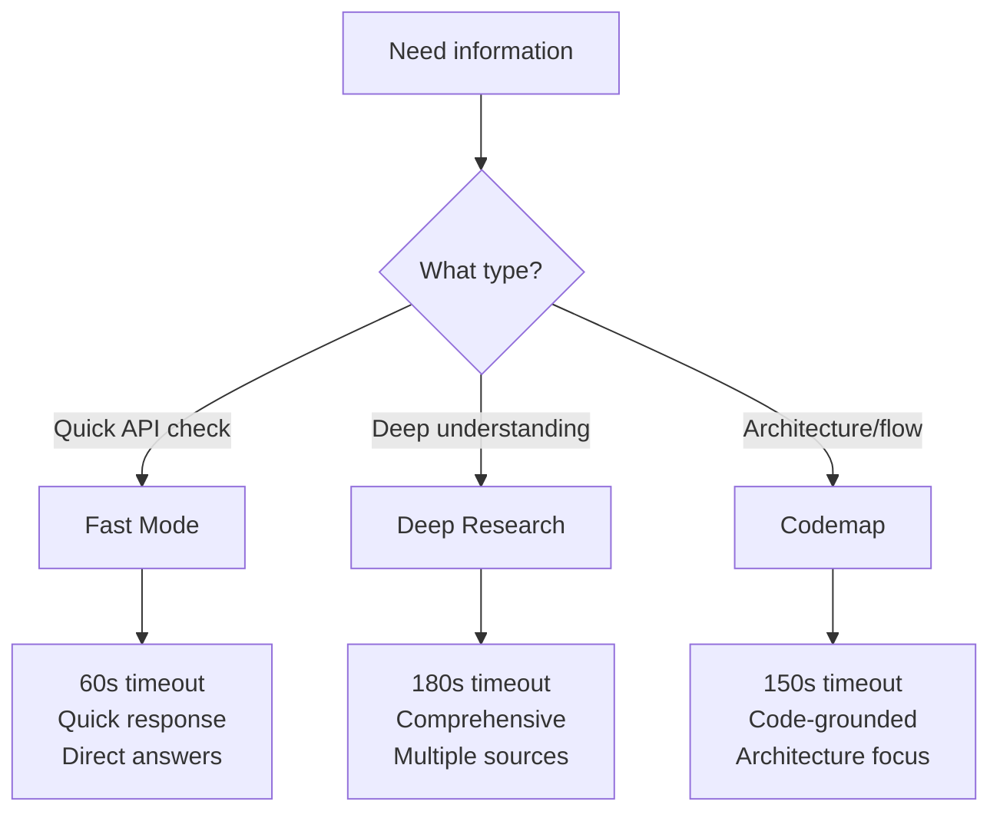
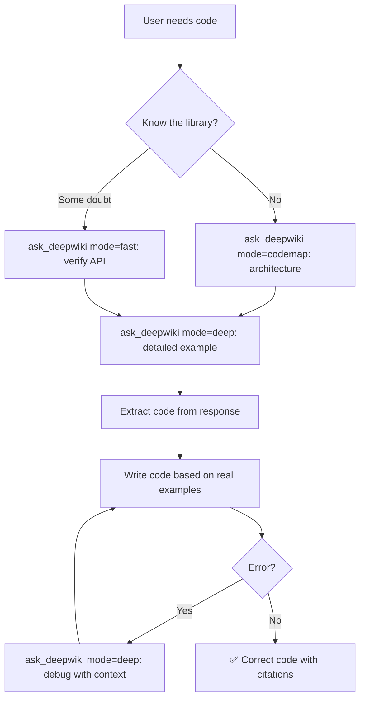

# DeepWiki Skill

> **PURPOSE**: Use `ask_deepwiki` to retrieve real code, architecture insights, and context from GitHub repositories. Now with **code extraction**, **multiple research modes**, and **adaptive timeouts**.

---

## 🆕 What's New in v3.0

- ✅ **Code Extraction**: Responses now include actual code snippets with file names and line numbers
- ✅ **Research Modes**: Fast, Deep Research, and Codemap for different investigation needs
- ✅ **Adaptive Timeouts**: Automatic wait time adjustment per mode
- ✅ **Structured Output**: Markdown format with code blocks and metadata

---

## 📚 Repository Configuration

### Your Configured Repositories

Configure repositories you frequently query:

```yaml
# Main Project Repositories
grblHAL/core:

grblHAL/RP2040:

LinuxCNC/linuxcnc:

```

### How to Add New Repositories

When you discover a useful repository:
1. Add it to the configuration above
2. Specify its purpose
3. List what you'll use it for
4. Choose recommended mode based on need

---

## Tool: `ask_deepwiki`

```python
ask_deepwiki(
    repo_path: str, 
    question: str,
    mode: str = 'fast'  # NEW: 'fast', 'deep', or 'codemap'
) -> str
```

### Parameters
- `repo_path`: The "owner/repo" format (e.g., `tiangolo/fastapi`, `grblHAL/core`)
- `question`: A specific, technical question
- `mode`: **NEW** - Research mode selection:
  - `'fast'`: Quick answers (60s timeout) - DEFAULT
  - `'deep'`: Thorough investigation (180s timeout)
  - `'codemap'`: Architecture-focused with code (150s timeout)

### Response Structure

Returns Markdown with two sections:

#### 1. Text Explanation
```markdown
## Respuesta
[Detailed explanation of the topic]
```

#### 2. Referenced Code (NEW)
```markdown
## Código Referenciado

### Archivo: grblHAL/core: kinematics/corexy.c
**Líneas 67-79**
```c
static inline float *transform_from_cartesian (float *target, float *position)
{
    uint_fast8_t idx;
    target[X_AXIS] = position[X_AXIS] + position[Y_AXIS];
    target[Y_AXIS] = position[X_AXIS] - position[Y_AXIS];
    // ...
}
```
```

---

## 🔬 Research Modes Guide

### Mode Selection Decision Tree



### Fast Mode (`mode='fast'`)

**When to use:**
- Quick verification of function signature
- Simple API lookups
- Checking parameter names
- Fast iteration during development

**Example:**
```python
ask_deepwiki(
    repo_path="tiangolo/fastapi",
    question="What parameters does @app.get() accept?",
    mode='fast'
)
```

### Deep Research Mode (`mode='deep'`)

**When to use:**
- Comprehensive understanding needed
- Multiple aspects of a topic
- Complex implementation details
- Learning new concepts thoroughly

**Example:**
```python
ask_deepwiki(
    repo_path="grblHAL/core",
    question="What is kinematics and how does it work?",
    mode='deep'
)
```

**Output characteristics:**
- Conceptual explanation
- API details
- Implementation specifics
- Direct file references (`kinematics.h:25-34`)

### Codemap Mode (`mode='codemap'`)

**When to use:**
- Understanding system architecture
- Tracing data/control flow
- Component interaction
- Design patterns

**Example:**
```python
ask_deepwiki(
    repo_path="grblHAL/core",
    question="How does the motion planning system work?",
    mode='codemap'
)
```

**Output characteristics:**
- Motivation → Details structure
- Component references ([5a], [5b])
- System coordination
- Architecture emphasis

---

## 🎯 How to Ask Effective Questions

### Principle 1: Be SPECIFIC

| ❌ Generic | ✅ Specific |
|---|---|
| "Tell me about this repo" | "Show the `Router` class in `router.py` and its main methods" |
| "How does auth work?" | "Show the JWT validation middleware implementation" |

### Principle 2: Include CONTEXT

Always mention:
- **Specific file** if known
- **Class or function** of interest
- **Version** if relevant (v1 vs v2)

```python
ask_deepwiki(
    repo_path="pydantic/pydantic",
    question="Show a complete v2 field_validator example with mode='before'",
    mode='deep'
)
```

### Principle 3: Match MODE to NEED

```python
# ❌ Wrong mode choice
ask_deepwiki(
    repo_path="grblHAL/core",
    question="How does the entire motion system architecture work?",
    mode='fast'  # Too complex for fast mode
)

# ✅ Correct mode choice
ask_deepwiki(
    repo_path="grblHAL/core",
    question="How does the entire motion system architecture work?",
    mode='codemap'  # Perfect for architecture
)
```

---

## 📋 Question Templates by Use Case

### Understanding a Function (Fast Mode)
```python
ask_deepwiki(
    repo_path="owner/repo",
    question="Function {name} in {file}: show signature, parameters, and usage example",
    mode='fast'
)
```

### Deep Dive into Implementation (Deep Mode)
```python
ask_deepwiki(
    repo_path="owner/repo",
    question="How does {feature} work? Show implementation details and design decisions",
    mode='deep'
)
```

### Understanding Architecture (Codemap)
```python
ask_deepwiki(
    repo_path="owner/repo",
    question="How do {component_a} and {component_b} coordinate? Show data flow",
    mode='codemap'
)
```

### Debugging an Error (Deep Mode)
```python
ask_deepwiki(
    repo_path="owner/repo",
    question="Error '{message}' with {function}. Show implementation, required params, edge cases",
    mode='deep'
)
```

---

## ⚡ Recommended Workflow



---

## 📊 Complete Examples

### Example 1: Learning grblHAL Kinematics

**Step 1 - Architecture overview (Codemap):**
```python
ask_deepwiki(
    repo_path="grblHAL/core",
    question="How is the kinematics subsystem organized? Show main components and their roles",
    mode='codemap'
)
```

**Step 2 - Deep dive (Deep Research):**
```python
ask_deepwiki(
    repo_path="grblHAL/core",
    question="What are the kinematics transformations in corexy? Show all transform functions",
    mode='deep'
)
```

**Step 3 - Quick verification (Fast):**
```python
ask_deepwiki(
    repo_path="grblHAL/core",
    question="What parameters does transform_from_cartesian accept?",
    mode='fast'
)
```

### Example 2: FastAPI Pattern

```python
# Quick check
ask_deepwiki(
    repo_path="tiangolo/fastapi",
    question="@router.post parameters: response_model and status_code",
    mode='fast'
)

# Deep understanding
ask_deepwiki(
    repo_path="tiangolo/fastapi",
    question="How does dependency injection work in FastAPI?",
    mode='deep'
)
```

---

## 📄 Working with Code Extraction

### Understanding the Output

DeepWiki now returns structured code blocks:

```markdown
## Código Referenciado

### Archivo: grblHAL/core: kinematics/corexy.c
**Líneas 54-65**
```c
static float *corexy_convert_array_steps_to_mpos (float *position, int32_t *steps)
{
    // ... code here
}
```
```

### Best Practices

1. **Cite the source**: Use file and line references in comments
```python
# From grblHAL/core: kinematics/corexy.c:67-79
def transform_from_cartesian(position):
    # Your implementation
```

2. **Verify line numbers**: Check if code is current via GitHub
3. **Adapt, don't copy**: Use as reference, adapt to your context
4. **Extract patterns**: Focus on patterns, not verbatim copying

---

## 🔍 Mode Comparison Table

| Aspect | Fast | Deep Research | Codemap |
|--------|------|---------------|---------|
| **Timeout** | 60s | 180s | 150s |
| **Best For** | Quick lookups | Comprehensive learning | Architecture |
| **Code Depth** | Basic snippets | Detailed implementations | Flow-focused |
| **Use Case** | API verification | Feature understanding | System design |
| **Response Style** | Direct answer | Conceptual + code | Motivation + details |
| **Iterations** | 3 checks | 5 checks | 4 checks |

---

## 🚫 Common Mistakes

| Mistake | Problem | Solution |
|---|---|---|
| Using fast for complex topics | Incomplete answer | Use `mode='deep'` or `'codemap'` |
| Vague questions | Generic answers | Specify file, class, function |
| No mode specified | Defaults to fast | Explicitly choose mode |
| Ignoring code blocks | Missing implementation | Extract and cite code sections |
| Wrong mode choice | Suboptimal answer | Match mode to question type |

---

## ✅ Checklist Before Writing Code

Before writing code that uses an external library:

- [ ] Identified correct repository from configuration?
- [ ] Chose appropriate research mode?
- [ ] Consulted exact function/class signature?
- [ ] Have real code example from DeepWiki response?
- [ ] Extracted code blocks with file/line references?
- [ ] Verified implementation matches my use case?
- [ ] Know the library's error handling pattern?
- [ ] Adapted code to current project style?
- [ ] Added source citations in comments?

---

## 💡 Pro Tips

1. **Start broad, then narrow**: Use `codemap` for architecture, then `deep` for specifics
2. **Iterate on questions**: Refine based on previous responses
3. **Save code snippets**: Keep extracted code organized by file
4. **Compare modes**: Try different modes for complex topics
5. **Update repo config**: Add new repos as you discover useful ones
