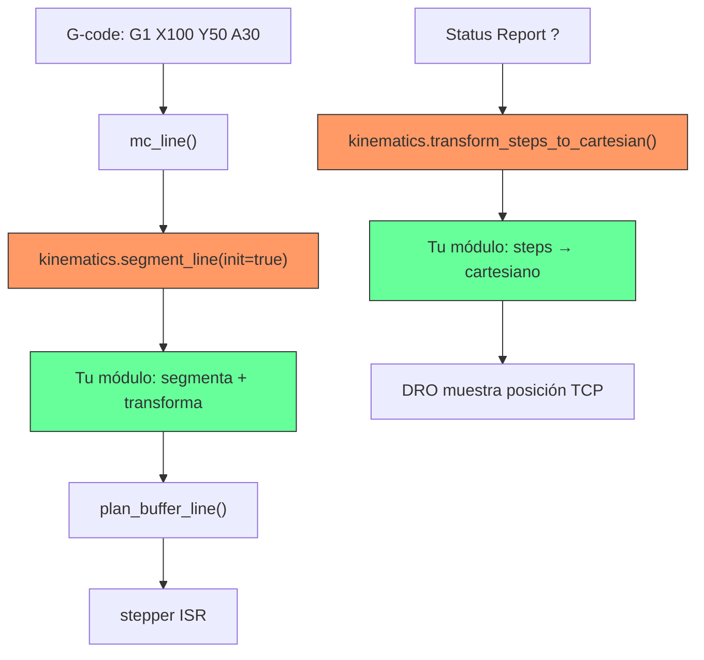

# Manual de Implementación de Cinemática Personalizada en grblHAL

## Índice

1. [Visión General de la Arquitectura](#1-visión-general-de-la-arquitectura)
2. [API de Cinemáticas (`kinematics.h`)](#2-api-de-cinemáticas)
3. [Paso a Paso: Crear tu Módulo](#3-paso-a-paso-crear-tu-módulo)
4. [Integración en el Build System](#4-integración-en-el-build-system)
5. [Modificaciones en Archivos Core](#5-modificaciones-en-archivos-core)
6. [Implementación de las Funciones Obligatorias](#6-implementación-de-las-funciones-obligatorias)
7. [Registro de Settings NVS](#7-registro-de-settings-nvs)
8. [Hooks Opcionales (Límites, Reportes, M-codes)](#8-hooks-opcionales)
9. [Trampas Conocidas y Soluciones](#9-trampas-conocidas-y-soluciones)
10. [Referencia Completa: Caso RTCP 5 Ejes](#10-referencia-completa-caso-rtcp)

---

## 1. Visión General de la Arquitectura

grblHAL utiliza un patrón de **inyección de funciones** para cinemática. El core define un struct global `kinematics` con punteros a función. Tu módulo los rellena durante la inicialización y grblHAL los invoca automáticamente durante el procesamiento de G-code.



### Flujo de datos

| Dirección | Función | Uso |
|---|---|---|
| **Cartesiano → Motor** | `transform_from_cartesian()` | Cinemática inversa |
| **Steps → Cartesiano** | `transform_steps_to_cartesian()` | Para DRO/reportes |
| **Segmentación** | `segment_line()` | Divide trayectorias largas |

---

## 2. API de Cinemáticas

Definido en [kinematics.h](file:///c:/simulador/src/grbl/kinematics.h):

```c
typedef struct {
    // === OBLIGATORIAS ===
    float *(*transform_steps_to_cartesian)(float *position, int32_t *steps);
    float *(*transform_from_cartesian)(float *target, float *position);
    float *(*segment_line)(float *target, float *position, 
                           plan_line_data_t *pl_data, bool init);
    
    // === HOMING ===
    uint_fast8_t (*limits_get_axis_mask)(uint_fast8_t idx);
    void (*limits_set_target_pos)(uint_fast8_t idx);
    void (*limits_set_machine_positions)(axes_signals_t cycle);
    
    // === OPCIONALES ===
    bool (*homing_cycle_validate)(axes_signals_t cycle);
    float (*homing_cycle_get_feedrate)(axes_signals_t axes, float rate, 
                                       homing_mode_t mode);
} kinematics_t;

extern kinematics_t kinematics;
```

### Descripción de cada función

| Función | Obligatoria | Descripción |
|---|:---:|---|
| `transform_from_cartesian` | ✅ | Convierte coordenadas TCP (cartesianas) a posiciones de motor |
| `transform_steps_to_cartesian` | ✅ | Convierte steps de motor a coordenadas TCP para DRO |
| `segment_line` | ✅ | Divide trayectorias en segmentos y transforma cada uno |
| `limits_get_axis_mask` | ✅ | Retorna máscara de bit para un eje durante homing |
| `limits_set_target_pos` | ✅ | Establece posición objetivo durante homing |
| `limits_set_machine_positions` | ✅ | Establece posiciones tras completar homing |
| `homing_cycle_validate` | ❌ | Valida si un ciclo de homing es permitido |
| `homing_cycle_get_feedrate` | ❌ | Ajusta velocidad de homing por eje |

---

## 3. Paso a Paso: Crear tu Módulo

### 3.1. Estructura de archivos

```
src/grbl/kinematics/
├── corexy.c          ← Ejemplo existente (simple)
├── delta.c           ← Ejemplo existente (con segmentación)
├── mi_cinematica.c   ← TU ARCHIVO NUEVO
└── mi_cinematica.h   ← HEADER PÚBLICO
```

### 3.2. Crear el Header (`mi_cinematica.h`)

```c
// mi_cinematica.h
#ifndef _MI_CINEMATICA_H_
#define _MI_CINEMATICA_H_

void mi_cinematica_init(void);

#endif
```

### 3.3. Estructura del archivo `.c`

```c
// mi_cinematica.c
#include "../grbl.h"

// ═══════════════════════════════════════════════════════════════
// GUARDA DE COMPILACIÓN CONDICIONAL
// ═══════════════════════════════════════════════════════════════
// 
// IMPORTANTE: Usar !MACRO (evalúa valor) en lugar de !defined(MACRO)
// porque grblHAL define COREXY, WALL_PLOTTER, etc. como 0 (Off),
// no como undefined. Con !defined() siempre entrarían como "definido".
//
#if defined(KINEMATICS_API) && !COREXY && !WALL_PLOTTER && !DELTA_ROBOT

#include <math.h>
#include <string.h>
#include "../hal.h"
#include "../settings.h"
#include "../nvs_buffer.h"
#include "../planner.h"
#include "../kinematics.h"
#include "../protocol.h"

// ═══════════════════════════════════════════════════════════════
// SECCIÓN 1: ESTRUCTURAS Y VARIABLES
// ═══════════════════════════════════════════════════════════════

typedef struct {
    float param1;
    float param2;
    // ... tus parámetros de configuración
} mi_settings_t;

static mi_settings_t mi_cfg;
static nvs_address_t nvs_address = 0;

// ═══════════════════════════════════════════════════════════════
// SECCIÓN 2: FUNCIONES DE CINEMÁTICA (ver sección 6 del manual)
// ═══════════════════════════════════════════════════════════════

static float *transform_from_cartesian(float *target, float *position) {
    // Tu cinemática inversa aquí
}

static float *transform_steps_to_cartesian(float *position, int32_t *steps) {
    // Tu cinemática directa aquí
}

static float *mi_segment_line(float *target, float *position,
                               plan_line_data_t *pl_data, bool init) {
    // Tu segmentación aquí
}

// ═══════════════════════════════════════════════════════════════
// SECCIÓN 3: FUNCIONES DE HOMING
// ═══════════════════════════════════════════════════════════════

static uint_fast8_t mi_limits_get_axis_mask(uint_fast8_t idx) {
    return bit(idx);  // 1:1 para ejes independientes
}

static void mi_limits_set_target_pos(uint_fast8_t idx) {
    sys.position[idx] = 0;
}

static void mi_limits_set_machine_positions(axes_signals_t cycle) {
    // Configura posiciones después del homing
}

// ═══════════════════════════════════════════════════════════════
// SECCIÓN 4: SETTINGS NVS (ver sección 7 del manual)
// ═══════════════════════════════════════════════════════════════

// ... (settings_save, settings_load, settings_restore)

// ═══════════════════════════════════════════════════════════════
// SECCIÓN 5: FUNCIÓN DE INICIALIZACIÓN
// ═══════════════════════════════════════════════════════════════

void mi_cinematica_init(void) {
    // Ver sección detallada abajo
}

#endif /* KINEMATICS_API && !COREXY && !WALL_PLOTTER && !DELTA_ROBOT */
```

---

## 4. Integración en el Build System

### 4.1. CMakeLists.txt

Archivo: [CMakeLists.txt](file:///c:/simulador/src/grbl/CMakeLists.txt)

Agregar tu archivo `.c` a la lista de sources:

```diff
  ${CMAKE_CURRENT_LIST_DIR}/kinematics/delta.c
  ${CMAKE_CURRENT_LIST_DIR}/kinematics/polar.c
+ ${CMAKE_CURRENT_LIST_DIR}/kinematics/mi_cinematica.c
 )
```

> [!IMPORTANT]
> El archivo se compila **siempre**, pero la guarda `#if defined(KINEMATICS_API)` controla si el código se activa.

---

## 5. Modificaciones en Archivos Core

### 5.1. `config.h` — Habilitar cinemática y ejes

Archivo: [config.h](file:///c:/simulador/src/grbl/config.h)

```diff
 #ifndef N_AXIS
-#define N_AXIS 3
+#define N_AXIS 6    // Ajustar al número de ejes de tu máquina
 #endif
```

```diff
-//#define KINEMATICS_API
+#define KINEMATICS_API    // Habilita hooks de cinemática
```

> [!CAUTION]
> **NO definir** `COREXY`, `WALL_PLOTTER` ni `DELTA_ROBOT` simultáneamente.
> Estas macros se evalúan como **valor** (0 = Off), no como presencia.
> La guarda `!COREXY` evalúa `!(0)` = `true`, que es lo correcto.

### 5.2. `nvs.h` — Ajustar tamaño de memoria NVS

Archivo: [nvs.h](file:///c:/simulador/src/grbl/nvs.h)

Con más de 3 ejes, la estructura `settings_t` crece significativamente. El NVS por defecto (2048 bytes) no alcanza:

```diff
 #ifndef NVS_SIZE
-#define NVS_SIZE 2048
+#define NVS_SIZE 4096    // Necesario para ≥5 ejes + settings de cinemática
 #endif
```

### 5.3. `grbllib.c` — Registrar tu módulo

Archivo: [grbllib.c](file:///c:/simulador/src/grbl/grbllib.c)

Dos cambios necesarios:

**1. Incluir tu header** (junto a los otros includes de cinemática):

```diff
 #ifdef KINEMATICS_API
 #include "kinematics.h"
+#include "kinematics/mi_cinematica.h"
 #endif
```

**2. Llamar a tu función init** en `grbl_enter()`:

```diff
 #if POLAR_ROBOT
     polar_init();
 #endif

+#ifdef KINEMATICS_API
+    mi_cinematica_init();
+#endif
+
 #if NVSDATA_BUFFER_ENABLE
     nvs_buffer_init();
 #endif
```

> [!WARNING]
> **El orden es CRÍTICO.** Tu init debe ir **ANTES** de `nvs_buffer_init()` para que `nvs_alloc()` reserve espacio antes de que el buffer se finalice.

---

## 6. Implementación de las Funciones Obligatorias

### 6.1. `transform_from_cartesian` — Cinemática Inversa

Convierte coordenadas del usuario (TCP/cartesianas) a posiciones de motor.

```c
static float *transform_from_cartesian(float *target, float *position) 
{
    // position[] contiene coordenadas cartesianas (X,Y,Z,A,B,C)
    // target[] debe llenarse con coordenadas de motor
    
    // EJEMPLO para identidad (sin transformación):
    memcpy(target, position, sizeof(float) * N_AXIS);
    
    // EJEMPLO para una transformación real:
    // float angle = position[A_AXIS];
    // target[X_AXIS] = position[X_AXIS] * cosf(angle) + ...;
    // target[Y_AXIS] = position[Y_AXIS] * sinf(angle) + ...;
    // target[Z_AXIS] = position[Z_AXIS];
    // target[A_AXIS] = position[A_AXIS];  // pasar ángulos directamente
    
    return target;
}
```

### 6.2. `transform_steps_to_cartesian` — Cinemática Directa

Convierte pasos de motor a coordenadas cartesianas para reportes de estado (DRO).

> [!CAUTION]
> **TRAMPA CRÍTICA:** No usar `system_convert_array_steps_to_mpos()`.
> Con `KINEMATICS_API` definido, esa función llama a `kinematics.transform_steps_to_cartesian()` — ¡esta misma función! — causando **recursión infinita** y **stack overflow**.

```c
static float *transform_steps_to_cartesian(float *position, int32_t *steps) 
{
    float mpos[N_AXIS];
    
    // ╔═══════════════════════════════════════════════════╗
    // ║ CONVERSIÓN DIRECTA steps → mm (SIN RECURSIÓN)    ║
    // ╚═══════════════════════════════════════════════════╝
    uint_fast8_t idx = N_AXIS;
    do {
        idx--;
        mpos[idx] = steps[idx] / settings.axis[idx].steps_per_mm;
    } while(idx);
    
    // Ahora aplica cinemática directa (motor → cartesiano)
    // EJEMPLO para identidad:
    memcpy(position, mpos, sizeof(float) * N_AXIS);
    
    // EJEMPLO para transformación real:
    // return transform_to_cartesian(position, mpos);
    
    return position;
}
```

### 6.3. `segment_line` — Segmentación de Trayectorias

Esta es la función más compleja. `mc_line()` la llama en dos fases:

```
Fase 1 (init=true):  Configurar segmentación, retornar destino motor
Fase 2 (init=false): Retornar siguiente segmento, NULL cuando termina
```

**Plantilla mínima (sin segmentación — tipo CoreXY):**

```c
static float *mi_segment_line(float *target, float *position,
                               plan_line_data_t *pl_data, bool init) 
{
    static uint_fast16_t iterations;
    static coord_data_t mpos;

    if (init) {
        // Transformar destino a coordenadas motor
        transform_from_cartesian(mpos.values, target);
        iterations = 2;  // Mínimo 2: init + 1 iteración
        
        // Validar límites
        if (!pl_data->condition.target_validated) {
            pl_data->condition.target_validated = On;
            pl_data->condition.target_valid = grbl.check_travel_limits(
                mpos.values, sys.soft_limits, false, &sys.work_envelope);
        }
        return mpos.values;
    }

    // Fase loop
    if (--iterations) {
        // Nada más — el target ya fue transformado en init
        return mpos.values;
    }
    
    return NULL;  // Señaliza fin de segmentación
}
```

**Plantilla avanzada (con segmentación — tipo Delta/RTCP):**

```c
static float *mi_segment_line(float *target, float *position,
                               plan_line_data_t *pl_data, bool init) 
{
    static uint_fast16_t iterations;
    static coord_data_t delta, segment_target, final_target, mpos;
    uint_fast8_t idx;

    if (init) {
        // Guardar destino final (cartesiano)
        memcpy(final_target.values, target, sizeof(coord_data_t));
        
        // Calcular distancia total
        float total_dist = 0.0f;
        idx = N_AXIS;
        do {
            idx--;
            float d = target[idx] - position[idx];  // position es motor en init
            total_dist += d * d;
        } while(idx);
        total_dist = sqrtf(total_dist);
        
        // Calcular número de segmentos
        #define MAX_SEG_MM 0.5f
        iterations = (uint_fast16_t)ceilf(total_dist / MAX_SEG_MM) + 1;
        if (iterations < 2) iterations = 2;
        
        // Calcular incremento por segmento
        float inv_iter = 1.0f / (float)(iterations - 1);
        idx = N_AXIS;
        do {
            idx--;
            delta.values[idx] = (target[idx] - position[idx]) * inv_iter;
            segment_target.values[idx] = position[idx];  // Empezar desde posición actual
        } while(idx);
        
        // Transformar destino final para validación
        transform_from_cartesian(mpos.values, target);
        
        if (!pl_data->condition.target_validated) {
            pl_data->condition.target_validated = On;
            pl_data->condition.target_valid = grbl.check_travel_limits(
                mpos.values, sys.soft_limits, false, &sys.work_envelope);
        }
        return mpos.values;
    }

    // Fase loop
    if (--iterations) {
        if (iterations == 1) {
            // Último segmento: usar coordenadas exactas
            transform_from_cartesian(mpos.values, final_target.values);
        } else {
            // Interpolar siguiente punto cartesiano
            idx = N_AXIS;
            do {
                idx--;
                segment_target.values[idx] += delta.values[idx];
            } while(idx);
            
            // Transformar a motor
            transform_from_cartesian(mpos.values, segment_target.values);
        }
        return mpos.values;
    }
    
    return NULL;
}
```

### 6.4. Funciones de Homing

Para máquinas con ejes independientes (la mayoría):

```c
static uint_fast8_t mi_limits_get_axis_mask(uint_fast8_t idx) {
    return bit(idx);  // Cada motor = un eje
}

static void mi_limits_set_target_pos(uint_fast8_t idx) {
    sys.position[idx] = 0;
}

static void mi_limits_set_machine_positions(axes_signals_t cycle) {
    uint_fast8_t idx = N_AXIS;
    do {
        idx--;
        if (cycle.mask & bit(idx)) {
            sys.position[idx] = lroundf(
                settings.axis[idx].max_travel * 
                settings.axis[idx].steps_per_mm);
        }
    } while(idx);
}
```

---

## 7. Registro de Settings NVS

Para guardar parámetros de configuración persistentes (ej: posición del pivote):

```c
// Definir IDs de settings
#define SETTING_MI_PARAM1  Setting_Kinematics0   // $350
#define SETTING_MI_PARAM2  Setting_Kinematics1   // $351

// Definir grupo
static const setting_group_detail_t mi_groups[] = {
    { Group_Kinematics, "Mi Cinemática" }
};

// Definir settings individuales
static const setting_detail_t mi_settings[] = {
    {
        .id = SETTING_MI_PARAM1,
        .group = Group_Kinematics,
        .name = "Parámetro 1",
        .value = "0.0",           // Valor por defecto
        .type = Setting_IsDecimal,
        .format = "###0.000",
        .unit = "mm",
        .min_value = "-1000",
        .max_value = "1000",
        .set_value = mi_set_float
    },
    // ... más settings
};

// Handler para escribir un setting
static status_code_t mi_set_float(setting_id_t id, float value) {
    switch(id) {
        case SETTING_MI_PARAM1:
            mi_cfg.param1 = value;
            break;
        // ...
    }
    mi_settings_save();
    return Status_OK;
}

// Handler para leer un setting
static float mi_get_float(setting_id_t id) {
    switch(id) {
        case SETTING_MI_PARAM1: return mi_cfg.param1;
        // ...
    }
    return 0.0f;
}

// Guardar/Cargar/Restaurar NVS
static void mi_settings_save(void) {
    hal.nvs.memcpy_to_nvs(nvs_address, (uint8_t *)&mi_cfg,
                           sizeof(mi_settings_t), true);
}

static void mi_settings_load(void) {
    if (hal.nvs.memcpy_from_nvs((uint8_t *)&mi_cfg, nvs_address,
                                 sizeof(mi_settings_t), true) 
            != NVS_TransferResult_OK) {
        mi_settings_restore();
    }
}

static void mi_settings_restore(void) {
    mi_cfg.param1 = 0.0f;
    mi_cfg.param2 = 0.0f;
    mi_settings_save();
}
```

---

## 8. Hooks Opcionales

### 8.1. Reporte de opciones (identificación)

```c
static on_report_options_ptr orig_on_report_options;

static void report_options(bool newopt) {
    if (orig_on_report_options)
        orig_on_report_options(newopt);
    if (!newopt)
        hal.stream.write("[KINEMATICS:Mi Cinematica v1.0]" ASCII_EOL);
}
```

### 8.2. Verificación de límites (hook)

Necesario si tu cinemática no es lineal:

```c
static bool (*orig_check_travel_limits)(float *, axes_signals_t, bool, work_envelope_t *);

static bool mi_check_travel_limits(float *target, axes_signals_t axes,
                                    bool is_cartesian, work_envelope_t *envelope) {
    if (is_cartesian) {
        // Transformar a motor primero
        float motors[N_AXIS];
        transform_from_cartesian(motors, target);
        // Verificar en espacio motor
        // ...
    }
    return orig_check_travel_limits 
        ? orig_check_travel_limits(target, axes, is_cartesian, envelope)
        : true;
}
```

### 8.3. M-codes personalizados (ej: activar/desactivar)

```c
static user_mcode_ptrs_t user_mcode_prev;

static user_mcode_type_t mi_mcode_check(user_mcode_t mcode) {
    if (mcode == 450 || mcode == 451)
        return UserMCode_Normal;
    return user_mcode_prev.check 
        ? user_mcode_prev.check(mcode) : UserMCode_Unsupported;
}
```

---

## 9. Trampas Conocidas y Soluciones

### ⚠️ Trampa 1: Recursión infinita en `transform_steps_to_cartesian`

| Problema | Solución |
|---|---|
| `system_convert_array_steps_to_mpos()` redirige a `kinematics.transform_steps_to_cartesian()` cuando `KINEMATICS_API` está definido | Usar conversión directa: `steps[idx] / settings.axis[idx].steps_per_mm` |

### ⚠️ Trampa 2: Guardas de preprocesador con `!defined()`

| Problema | Solución |
|---|---|
| `!defined(COREXY)` siempre es `false` porque `COREXY` está definido como `0` | Usar `!COREXY` que evalúa el **valor** (`!0` = `true`) |

### ⚠️ Trampa 3: Orden de inicialización en `grbllib.c`

| Problema | Solución |
|---|---|
| Si tu init va **después** de `nvs_buffer_init()`, `nvs_alloc()` falla silenciosamente | Colocar tu init **ANTES** de `nvs_buffer_init()` |

### ⚠️ Trampa 4: NVS_SIZE insuficiente

| Problema | Solución |
|---|---|
| Con ≥5 ejes, `settings_t` crece y 2048 bytes no alcanza | Aumentar `NVS_SIZE` a 4096 en `nvs.h` |

### ⚠️ Trampa 5: Floats en directivas `#if`

| Problema | Solución |
|---|---|
| `#if MY_FLOAT_CONST <= 0` causa error de preprocesador | El preprocesador C no soporta floats. Usar `_Static_assert` o eliminar la validación |

### ⚠️ Trampa 6: Acceso a TLO

| Problema | Solución |
|---|---|
| `gc_state.tool_length_offset` no existe | El campo correcto es `gc_state.modal.tool_length_offset[N_AXIS]` |

### ⚠️ Trampa 7: Movimiento lento por exceso de segmentación

| Problema | Causa |
|---|---|
| Movimientos con muchos segmentos cortos se mueven más lento de lo esperado | El planner necesita distancia acumulada para acelerar. Con segmentos muy cortos, el buffer no contiene suficiente distancia total para alcanzar la velocidad nominal |

El planner utiliza un buffer de lookahead (por defecto 100 bloques) para optimizar el perfil de velocidad. Si cada segmento es muy corto (ej: 0.1mm), 100 bloques = solo 10mm de distancia, lo cual puede ser insuficiente para acelerar a la velocidad programada.

**Soluciones (en orden de preferencia):**

1. **Aumentar aceleración de la máquina** (`$120`-`$122`): El planner alcanza velocidad nominal más rápido con la misma distancia disponible. Es lo más efectivo porque no sacrifica precisión.

2. **Aumentar `MAX_SEG_LENGTH_MM`** (en tu módulo de cinemática): Por ejemplo, de 0.5mm a 1.0mm. Menos segmentos = más distancia por bloque = mayor velocidad. El costo es menor precisión geométrica en trayectorias con curvatura alta.

3. **Aumentar el buffer del planner** vía `$340` (planner blocks): Más bloques en el buffer = más distancia de lookahead. En plataformas ARM (RP2040/RP2350), se pueden usar 150-200 bloques sin problemas de memoria. El costo es mayor uso de RAM y más cálculos por recalculación del planner.

> [!TIP]
> Puedes monitorear el estado del buffer en tiempo real con el campo `|Bf:` del status report. Si ves valores bajos (< 10 bloques disponibles) durante movimientos segmentados, considera aumentar el tamaño del buffer.

### ⚠️ Trampa 8: Saturación del buffer del planner durante segmentación

| Problema | Causa |
|---|---|
| El procesador se bloquea brevemente durante movimientos altamente segmentados | `segment_line()` genera todos los segmentos en un loop dentro de `mc_line()`. Cuando el buffer se llena, el loop espera a que el stepper ISR consuma bloques |

Cuando generas muchos segmentos (ej: 200 para un movimiento `G1 X100 A2`), el buffer de 100 bloques se llena y `mc_line()` entra en un ciclo de espera:

```c
do {
    protocol_execute_realtime();    // Procesa aborts, holds
    protocol_auto_cycle_start();    // Inicia ejecución para liberar espacio
} while(plan_check_full_buffer());
```

**Esto NO es un bug** — grblHAL lo maneja correctamente. Pero ten en cuenta:

- Durante la espera, el procesador no puede atender otras tareas (parsing de nuevo G-code, por ejemplo)
- Si llega un abort (`!`) o feed hold durante la espera, `protocol_execute_realtime()` lo detecta
- El stepper ISR consume bloques a ~100Hz (10ms por segmento), así que la espera es breve

**Mitigación:** No se requiere acción. Si necesitas mayor responsividad del sistema, aumenta `$340` (planner blocks) para reducir la frecuencia de bloqueos.

### ⚠️ Trampa 9: Mezcla de unidades mm y grados en el planner

| Problema | Causa |
|---|---|
| El planner calcula la distancia del bloque mezclando mm y grados | `convert_delta_vector_to_unit_vector()` calcula `sqrt(ΔX² + ΔY² + ΔZ² + ΔA² + ΔC²)` sin distinguir unidades |

Esto afecta el cálculo de `block->millimeters`, que el planner usa para:
- Perfiles de aceleración/desaceleración
- Junction velocity entre bloques consecutivos
- Velocidad nominal del bloque

**Impacto real:**

En la mayoría de segmentos RTCP, el impacto es **despreciable** porque la segmentación angular hace que `ΔA` sea muy pequeño (típicamente 0.01°–0.5°) comparado con `ΔX/Y/Z` (0.5mm). Sin embargo, en movimientos **puramente rotativos** (`G1 A45` sin mover XYZ), toda la "distancia" viene de grados tratados como mm.

**¿Cómo lo mitiga tu `rate_multiplier`?**

Tu compensación de velocidad en `segment_line()` calcula la distancia **real** de motor y ajusta el feed rate proporcionalmente. Esto corrige la velocidad de cada segmento individual, aunque el planner internamente use una distancia mixta.

**¿Debería activarse `ROTARY_FIX`?**

No. `ROTARY_FIX` (`#define ROTARY_FIX 1` en `planner.c`) está diseñado para máquinas cartesianas sin cinemática personalizada. Convierte el feed rate a modo inverse time (G93) cuando hay movimiento simultáneo lineal+rotativo. Si se activa junto con tu `rate_multiplier`, se produciría una **doble corrección** del feed rate. Mantén `ROTARY_FIX 0` (valor por defecto) y confía en tu `rate_multiplier`.

---

## 10. Referencia Completa: Caso RTCP

### Función de inicialización completa

Basada en [rtcp_5axis_init](file:///c:/simulador/src/grbl/kinematics/rtcp.c#L1517-L1604):

```c
void mi_cinematica_init(void) 
{
    // 1. Definir settings (static para que persistan)
    static setting_details_t setting_details = {
        .is_core = true,
        .groups = mi_groups,
        .n_groups = sizeof(mi_groups) / sizeof(setting_group_detail_t),
        .settings = mi_settings,
        .n_settings = sizeof(mi_settings) / sizeof(setting_detail_t),
        .load = mi_settings_load,
        .save = mi_settings_save,
        .restore = mi_settings_restore,
    };

    // 2. Reservar espacio NVS (DEBE hacerse antes de nvs_buffer_init)
    if ((nvs_address = nvs_alloc(sizeof(mi_settings_t)))) {
        
        // 3. Registrar funciones OBLIGATORIAS
        kinematics.transform_from_cartesian = transform_from_cartesian;
        kinematics.transform_steps_to_cartesian = transform_steps_to_cartesian;
        kinematics.segment_line = mi_segment_line;
        
        // 4. Registrar funciones de homing
        kinematics.limits_get_axis_mask = mi_limits_get_axis_mask;
        kinematics.limits_set_target_pos = mi_limits_set_target_pos;
        kinematics.limits_set_machine_positions = mi_limits_set_machine_positions;
        
        // 5. Hooks opcionales (patrón chain)
        orig_on_report_options = grbl.on_report_options;
        grbl.on_report_options = report_options;
        
        orig_check_travel_limits = grbl.check_travel_limits;
        grbl.check_travel_limits = mi_check_travel_limits;
        
        // 6. Registrar settings con grblHAL
        settings_register(&setting_details);
        
        // 7. Cargar configuración desde NVS
        mi_settings_load();
    }
}
```

### Checklist final de integración

```
[ ] mi_cinematica.h creado con declaración de init
[ ] mi_cinematica.c con guarda #if defined(KINEMATICS_API) && !COREXY ...
[ ] CMakeLists.txt actualizado con mi_cinematica.c
[ ] config.h: N_AXIS ajustado, KINEMATICS_API habilitado
[ ] nvs.h: NVS_SIZE = 4096 (si >3 ejes)
[ ] grbllib.c: include de mi_cinematica.h
[ ] grbllib.c: mi_cinematica_init() ANTES de nvs_buffer_init()
[ ] transform_steps_to_cartesian NO usa system_convert_array_steps_to_mpos
[ ] Compilar y verificar que inicia sin crash
[ ] Enviar $I y confirmar [KINEMATICS:...] en respuesta
```

### Archivos modificados en la integración RTCP

| Archivo | Cambio |
|---|---|
| [config.h](file:///c:/simulador/src/grbl/config.h) | `N_AXIS=6`, `KINEMATICS_API` habilitado |
| [nvs.h](file:///c:/simulador/src/grbl/nvs.h) | `NVS_SIZE=4096` |
| [CMakeLists.txt](file:///c:/simulador/src/grbl/CMakeLists.txt) | Añadido `kinematics/rtcp.c` |
| [grbllib.c](file:///c:/simulador/src/grbl/grbllib.c) | Include `rtcp.h`, llamada a `rtcp_5axis_init()` |
| [rtcp.h](file:///c:/simulador/src/grbl/kinematics/rtcp.h) | **[NUEVO]** Header público |
| [rtcp.c](file:///c:/simulador/src/grbl/kinematics/rtcp.c) | Fix recursión, guardas, TLO |
