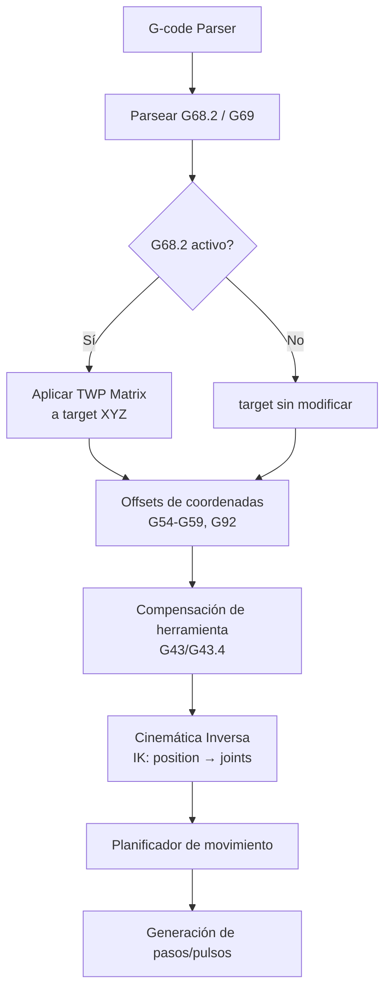
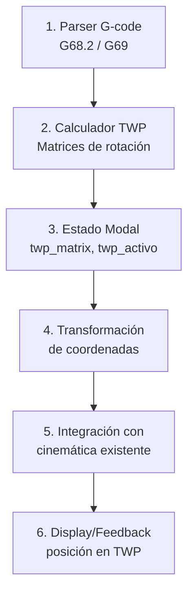
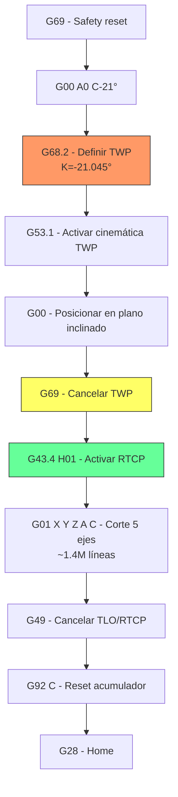

# Manual de Implementación G68.2 — Plano de Trabajo Inclinado (TWP)

> Guía exhaustiva basada en el análisis de LinuxCNC, Marlin (DerAndere1) y g2core (Synthetos)

---

## 1. ¿Qué es G68.2?

G68.2 (Tilted Work Plane / Plano de Trabajo Inclinado) es un G-code que **redefine el sistema de coordenadas de trabajo** rotándolo en el espacio 3D. Permite programar trayectorias de mecanizado en un plano arbitrario como si fuera el plano XY estándar.

### Diferencia clave: G68 vs G68.2

| Característica | G68 | G68.2 |
|---|---|---|
| **Rotación** | Solo 2D (alrededor de Z) | 3D completa (cualquier orientación) |
| **Parámetros** | `R` (ángulo), `X Y` (centro) | `P Q X Y Z I J K R` |
| **Uso** | Rotar piezas planas | Mecanizado 5 ejes, superficies inclinadas |
| **Matemática** | Matriz 2×2 rotación | Matriz 4×4 transformación homogénea |

### Sintaxis estándar

```gcode
G68.2 P_ Q_ X_ Y_ Z_ I_ J_ K_ R_
```

| Parámetro | Significado |
|---|---|
| `P` | Modo de definición (0-3) |
| `Q` | Orden de rotación Euler / sub-llamada |
| `X Y Z` | Origen del plano inclinado |
| `I J K` | Ángulos de Euler (grados) |
| `R` | Rotación adicional del eje X del plano |

---

## 2. Fundamentos Matemáticos

### 2.1 Matrices de Rotación Elementales

Las tres matrices de rotación fundamentales alrededor de cada eje:

**Rotación alrededor de X (Rx)**:
```
Rx(θ) = | 1    0       0    |
         | 0    cos(θ) -sin(θ)|
         | 0    sin(θ)  cos(θ)|
```

**Rotación alrededor de Y (Ry)**:
```
Ry(θ) = | cos(θ)  0   sin(θ)|
         | 0       1   0     |
         |-sin(θ)  0   cos(θ)|
```

**Rotación alrededor de Z (Rz)**:
```
Rz(θ) = | cos(θ) -sin(θ)  0|
         | sin(θ)  cos(θ)  0|
         | 0       0       1|
```

> [!IMPORTANT]
> Estas matrices se implementan exactamente así en LinuxCNC (`remap.py` líneas 613-627). Son los bloques fundamentales para construir cualquier rotación 3D.

### 2.2 Ángulos de Euler vs Tait-Bryan

Existen **dos familias** de secuencias de rotación:

**Ángulos de Euler (ejes repetidos):**
- ZXZ (313), ZYZ (323), XYX (121), XZX (131), YXY (212), YZY (232)
- Ejemplo: `R = Rz(θ1) · Rx(θ2) · Rz(θ3)` para orden 313

**Ángulos de Tait-Bryan (ejes distintos):**
- XYZ (123), XZY (132), YXZ (213), YZX (231), ZXY (312), ZYX (321)
- Ejemplo: `R = Rx(θ1) · Ry(θ2) · Rz(θ3)` para orden 123

### 2.3 Construcción de la Matriz de Rotación Combinada

La función clave toma tres ángulos (I, J, K → θ1, θ2, θ3) y un orden (Q) y produce la matriz 3×3:

```python
def calcular_matriz_euler(th1, th2, th3, orden):
    th1 = radians(th1)  # I en grados → radianes
    th2 = radians(th2)  # J en grados → radianes
    th3 = radians(th3)  # K en grados → radianes
    
    if orden == '313':    # ZXZ (Euler verdadero, default)
        R = Rz(th1) @ Rx(th2) @ Rz(th3)
    elif orden == '323':  # ZYZ
        R = Rz(th1) @ Ry(th2) @ Rz(th3)
    elif orden == '123':  # XYZ (Tait-Bryan, pitch-roll-yaw)
        R = Rx(th1) @ Ry(th2) @ Rz(th3)
    elif orden == '321':  # ZYX
        R = Rz(th1) @ Ry(th2) @ Rx(th3)
    # ... (12 combinaciones posibles)
    return R
```

### 2.4 Matriz de Transformación Homogénea 4×4

El resultado final es una matriz 4×4 que combina rotación y traslación:

```
TWP = | R[0][0]  R[0][1]  R[0][2]  Tx |
      | R[1][0]  R[1][1]  R[1][2]  Ty |
      | R[2][0]  R[2][1]  R[2][2]  Tz |
      | 0        0        0        1  |
```

Donde:
- **Columna 0** (`R[:,0]`): Vector X del plano inclinado (dirección de la herramienta X)
- **Columna 1** (`R[:,1]`): Vector Y del plano inclinado
- **Columna 2** (`R[:,2]`): Vector Z del plano inclinado (normal al plano = dirección de la herramienta)
- **Columna 3** (`[Tx,Ty,Tz,1]`): Origen del plano inclinado

### 2.5 Rotación Adicional R (Pre-rotación del Origen)

El parámetro `R` aplica una rotación extra del vector X del plano alrededor del eje Z del plano. Se implementa como:

```python
R_origen = calcular_matriz_euler(0, R, 0, '131')  # XZX con solo θ2=R
R_total = R_origen @ R_euler
```

Esto permite orientar la dirección de corte dentro del plano inclinado.

---

## 3. Los 4 Modos de Definición (Parámetro P)

### 3.1 Modo P0 — Ángulos de Euler Verdaderos

```gcode
G68.2 P0 Q313 X_ Y_ Z_ I_ J_ K_ R_
```

- **Q**: Secuencia de rotación Euler (121, 131, 212, 232, **313**, 323)
- **I, J, K**: Los tres ángulos θ1, θ2, θ3 en grados
- **X, Y, Z**: Origen del plano
- **R**: Rotación adicional del eje X del plano
- **Default Q**: 313 (ZXZ) — el más común en máquinas CNC

**Lógica de implementación:**
1. Parsear X, Y, Z como origen
2. Parsear I, J, K como ángulos de Euler
3. Calcular `R_origen = Euler(0, R, 0, '131')`
4. Calcular `R_euler = Euler(I, J, K, Q)`
5. `R_total = R_origen × R_euler`
6. Ensamblar la matriz 4×4: `TWP = [R_total | origen; 0 0 0 1]`

### 3.2 Modo P1 — Ángulos de Tait-Bryan

```gcode
G68.2 P1 Q123 X_ Y_ Z_ I_ J_ K_ R_
```

- **Q**: Secuencia Tait-Bryan (**123**, 132, 213, 231, 312, 321)
- Idéntico a P0 excepto que solo acepta secuencias con ejes distintos
- Útil para pitch/roll/yaw más intuitivo

### 3.3 Modo P2 — Tres Puntos en el Plano (4 sub-llamadas)

```gcode
G68.2 P2 Q0 X_ Y_ Z_ R_        (origen + rotación)
G68.2 P2 Q1 X_ Y_ Z_            (punto 1)
G68.2 P2 Q2 X_ Y_ Z_            (punto 2)
G68.2 P2 Q3 X_ Y_ Z_            (punto 3)
```

**Lógica de cálculo:**
1. **Q0**: Define el origen del plano y la rotación R
2. **Q1**: Punto P1
3. **Q2**: Punto P2 — la dirección P1→P2 define el eje X del plano
4. **Q3**: Punto P3 — define el lado Y+ del plano

```python
# Vector X: dirección de P1 a P2 (normalizado)
vect_x = normalizar(P2 - P1)
# Vector auxiliar: P1 a P3
v2 = normalizar(P3 - P1)
# Vector Z: producto cruzado X × v2 (normal al plano)
vect_z = cruz(vect_x, v2)
# Vector Y: producto cruzado Z × X
vect_y = cruz(vect_z, vect_x)
# Ensamblar matriz de rotación: columnas = [vect_x, vect_y, vect_z]
R = transponer([vect_x, vect_y, vect_z])
```

> [!WARNING]
> Si los 3 puntos son colineales, el producto cruzado produce un vector nulo → la matriz contiene NaN/Inf. **Se debe validar** que los puntos no sean colineales.

### 3.4 Modo P3 — Dos Vectores Explícitos (2 sub-llamadas)

```gcode
G68.2 P3 Q0 X_ Y_ Z_ I_ J_ K_ R_   (origen + vector X + rotación)
G68.2 P3 Q1 I_ J_ K_                 (vector normal / Z del plano)
```

**Lógica:**
1. **Q0**: [(X,Y,Z)](file:///c:/simulador/src/grbl/kinematics/rtcp.c#1216-1219) = origen, [(I,J,K)](file:///c:/simulador/src/grbl/kinematics/rtcp.c#1216-1219) = punto que define dirección X
2. **Q1**: [(I,J,K)](file:///c:/simulador/src/grbl/kinematics/rtcp.c#1216-1219) = vector normal del plano (eje Z)
3. Verificar ortogonalidad: `dot(vect_x, vect_z) == 0`
4. `vect_y = cruz(vect_z, vect_x)`
5. Ensamblar matriz

> [!CAUTION]
> Los dos vectores DEBEN ser ortogonales. Si no lo son, se debe reportar error.

---

## 4. Aplicación de la Transformación a Movimientos G-code

### 4.1 Transformación Directa (Work → Machine)

Cuando G68.2 está activo, cada coordenada de destino G-code se transforma:

```python
# target = coordenadas programadas en el plano inclinado
# R = submatriz 3×3 de rotación de la TWP matrix

target_machine[X] = target[X]*R[0][0] + target[Y]*R[0][1] + target[Z]*R[0][2]
target_machine[Y] = target[X]*R[1][0] + target[Y]*R[1][1] + target[Z]*R[1][2]
target_machine[Z] = target[X]*R[2][0] + target[Y]*R[2][1] + target[Z]*R[2][2] + z_offset
```

Los ejes rotativos (A, B, C) **NO se rotan** — pasan directamente.

### 4.2 Transformación Inversa (Machine → Display)

Para mostrar la posición actual en coordenadas del plano inclinado, se usa la **transpuesta** de la matriz (para matrices ortogonales, la transpuesta es igual a la inversa):

```python
# pos = posición actual de la máquina
display[X] = pos[0]*R[0][0] + pos[1]*R[1][0] + pos[2]*R[2][0]
display[Y] = pos[0]*R[0][1] + pos[1]*R[1][1] + pos[2]*R[2][1]
display[Z] = pos[0]*R[0][2] + pos[1]*R[1][2] + pos[2]*R[2][2] - z_offset
```

### 4.3 Dónde Aplicar la Transformación en el Pipeline



> [!IMPORTANT]
> La transformación TWP se aplica **ANTES** de la cinemática inversa. Es un paso de pre-procesamiento en el pipeline de coordenadas, no un reemplazo de la cinemática.

---

## 5. Interacción con Otros Sistemas

### 5.1 G69 — Cancelación del Plano Inclinado

G69 **reset** la matriz TWP a la identidad:

```python
def g69():
    twp_matrix = identidad_4x4()  # [[1,0,0,0],[0,1,0,0],[0,0,1,0],[0,0,0,1]]
    twp_activo = False
    # Señalizar al sistema que TWP ya no está definido
```

**Consideraciones de G69:**
- No se debe sincronizar posición (la posición física no cambia)
- Se debe actualizar el estado modal del interprete
- En LinuxCNC, se implementa como NGC sub + Python core (`M469 → g69_core`)

### 5.2 G43/G43.4 — Compensación de Herramienta

| Sistema | Interacción con TWP |
|---|---|
| **LinuxCNC** | Tool offset se suma en espacio de trabajo **antes** de la rotación TWP. El offset Z de herramienta se proyecta correctamente en los 3 ejes máquina |
| **g2core** | Tool offset NO se rota a través de la matriz de inclinación — **geométricamente incorrecto** para ángulos grandes |
| **Marlin** | RTCP (G43.4) vive en la cinemática inversa, separado de G68 |

> [!WARNING]
> **Decisión crítica**: El offset de longitud de herramienta debe rotarse a través de la matriz TWP para ser correcto. Si se aplica como un offset plano en Z sin rotar, el TCP se desplazará incorrectamente para ángulos de inclinación grandes.

**Implementación correcta:**
```python
# El tool offset DEBE ser rotado por la matriz TWP
tool_offset_world = R @ tool_offset_local
# Donde tool_offset_local = [0, 0, tool_length] para herramientas estándar
```

### 5.3 RTCP (G43.4) vs G68.2

Son conceptos **complementarios pero distintos**:

| Concepto | G68.2 (TWP) | G43.4 (RTCP) |
|---|---|---|
| **Propósito** | Redefinir sistema de coordenadas | Mantener TCP fijo al rotar ejes |
| **Dónde actúa** | Pre-procesamiento de coordenadas | Cinemática inversa |
| **Requiere** | Solo matemática de matrices | Conocer geometría física de la máquina |
| **Variables** | Ángulos de Euler, origen | Pivot length, MRZP offsets |

En un flujo 5 ejes completo:
1. **G68.2** define el plano de trabajo inclinado
2. **G53.1/G53.3** activa la cinemática del plano inclinado (orienta los ejes rotativos)
3. **G43.4** activa RTCP para compensar el punto de pivote

### 5.4 Planos de Trabajo (G17/G18/G19)

Cambiar el plano de trabajo mientras G68.2 está activo **debe ser bloqueado o manejado con cuidado**. En Marlin, cambiar G17/G18/G19 con rotación activa produce un error.

### 5.5 Sistemas de Coordenadas (G54-G59)

LinuxCNC restringe G68.2 al sistema G54 activo para evitar inconsistencias. La razón es que al resetear/cancelar, LinuxCNC revierte a G54 como default.

### 5.6 Arcos (G2/G3) en Plano Inclinado

Los arcos G2/G3 se interpretan en el plano inclinado y luego se linealizan (segmentación) para producir movimientos lineales en coordenadas máquina. La segmentación es controlada por `segments_per_second`.

---

## 6. Análisis Comparativo de Implementaciones

### 6.1 LinuxCNC — Implementación Completa

| Aspecto | Detalle |
|---|---|
| **Archivo principal** | `configs/sim/axis/vismach/5axis/table-rotary_spindle-rotary-nutating/python/remap.py` |
| **Mecanismo** | Python remap vía INI `[RS274NGC] REMAP = G68.2 modalgroup=1 argspec=pqxyzijkr python=g682` |
| **Modos soportados** | P0 (Euler), P1 (Tait-Bryan), P2 (3 puntos), P3 (2 vectores) |
| **Órdenes Euler** | Todos los 12: 121,131,212,232,313,323,123,132,213,231,312,321 |
| **Dependencias** | NumPy para álgebra matricial |
| **Visualización** | HAL component `twp-helper-comp` publica vectores X, Z y origen a Vismach |
| **Restricción** | Solo funciona desde G54 |
| **G-codes relacionados** | G68.3, G68.4, G53.1, G53.3, G53.6, G69 |

**Flujo de activación en LinuxCNC:**
```
G68.2 → define TWP (solo matemáticas, no mueve nada)
G53.1/G53.3 → activa cinemática TWP (orienta ejes rotativos al plano)
G53.6 → desactiva cinemática TWP (vuelve a modo identidad)
G69 → cancela definición TWP
```

### 6.2 Marlin (DerAndere1) — Solo G68 (2D) + PENTA_AXIS

| Aspecto | Detalle |
|---|---|
| **G68 archivo** | `Marlin/src/gcode/geometry/G68-G69.cpp` |
| **G68 tipo** | Solo rotación 2D XY alrededor de Z |
| **G68.2** | **NO implementado** |
| **5 ejes** | Via PENTA_AXIS (TRT, HT, HH) + G43.4 |
| **Kinemáticas** | `penta_axis_trt.cpp`, `penta_axis_ht.cpp`, `penta_axis_head_head.cpp` |
| **Parámetros TRT** | MRZP offsets (X,Y,Z), Rotational joint offsets (X,Y,Z), segments_per_second |
| **Configuración** | `Configuration.h` defines + M665 para ajuste runtime |
| **Basado en** | LinuxCNC `trtfuncs.c`, `maxkins.c`, `5axiskins.c` |

**Matriz de rotación TRT (XYZAC):**
```
X_joint =  cos(C)·px + sin(C)·py
Y_joint = -sin(C)·cos(A)·px + cos(C)·cos(A)·py + sin(A)·pz - cos(A)·Dy - sin(A)·Dz + Dy
Z_joint =  sin(C)·sin(A)·px - cos(C)·sin(A)·py + cos(A)·pz + sin(A)·Dy - cos(A)·Dz + Dz

Donde px,py,pz = posición - MRZP_offset y Dy,Dz = rotational_offset
```

### 6.3 g2core (Synthetos) — Infraestructura sin G68.2

| Aspecto | Detalle |
|---|---|
| **G68.2** | **NO implementado** (parser no tiene `case 68:`) |
| **Infraestructura** | `rotation_matrix[3][3]` + `rotation_z_offset` en `cmMachine_t` |
| **Uso actual** | Solo para tramming con sonda (probed-surface alignment) |
| **Aplicación** | En `mp_aline()` se aplica la rotación a X,Y,Z; ABC/UVW pasan sin modificar |
| **Display inverso** | `mp_get_runtime_display_position()` usa transpuesta |
| **Reset** | `canonical_machine_reset_rotation()` → identidad; llamado en G28.2 (homing) |
| **Falta** | Parser G68/G69, cálculo Euler→matrix, rotación de tool offset |

---

## 7. Guía de Implementación para grblHAL

### 7.1 Componentes Necesarios



### 7.2 Paso 1: Estructuras de Datos

```c
// Estado del plano de trabajo inclinado
typedef struct {
    float matrix[3][3];    // Matriz de rotación 3×3
    float origin[3];       // Origen del TWP (X, Y, Z)
    float z_offset;        // Offset Z adicional
    bool is_defined;       // TWP ha sido definido por G68.2
    bool is_active;        // TWP está aplicándose a movimientos
    uint8_t p_mode;        // Modo P actual (0-3)
    uint8_t euler_order;   // Orden de rotación (ej: 313)
} twp_state_t;

static twp_state_t twp = {
    .matrix = {{1,0,0}, {0,1,0}, {0,0,1}},  // identidad
    .origin = {0, 0, 0},
    .z_offset = 0.0f,
    .is_defined = false,
    .is_active = false,
};
```

### 7.3 Paso 2: Matrices de Rotación Elementales

```c
// Rotación alrededor de X
static void rotation_x(float th, float R[3][3]) {
    float c = cosf(th), s = sinf(th);
    R[0][0]=1; R[0][1]=0; R[0][2]=0;
    R[1][0]=0; R[1][1]=c; R[1][2]=-s;
    R[2][0]=0; R[2][1]=s; R[2][2]=c;
}

// Rotación alrededor de Y
static void rotation_y(float th, float R[3][3]) {
    float c = cosf(th), s = sinf(th);
    R[0][0]=c;  R[0][1]=0; R[0][2]=s;
    R[1][0]=0;  R[1][1]=1; R[1][2]=0;
    R[2][0]=-s; R[2][1]=0; R[2][2]=c;
}

// Rotación alrededor de Z
static void rotation_z(float th, float R[3][3]) {
    float c = cosf(th), s = sinf(th);
    R[0][0]=c; R[0][1]=-s; R[0][2]=0;
    R[1][0]=s; R[1][1]=c;  R[1][2]=0;
    R[2][0]=0; R[2][1]=0;  R[2][2]=1;
}

// Multiplicar dos matrices 3×3: C = A × B
static void mat3_multiply(const float A[3][3], const float B[3][3], float C[3][3]) {
    for (int i = 0; i < 3; i++)
        for (int j = 0; j < 3; j++) {
            C[i][j] = 0;
            for (int k = 0; k < 3; k++)
                C[i][j] += A[i][k] * B[k][j];
        }
}
```

### 7.4 Paso 3: Cálculo de la Rotación Euler

```c
typedef enum {
    EULER_313 = 0,  // ZXZ (default para G68.2 P0)
    EULER_323,      // ZYZ
    EULER_121,      // XYX
    EULER_131,      // XZX
    EULER_212,      // YXY
    EULER_232,      // YZY
    TAIT_123,       // XYZ (default para G68.2 P1)
    TAIT_132,       // XZY
    TAIT_213,       // YXZ
    TAIT_231,       // YZX
    TAIT_312,       // ZXY
    TAIT_321,       // ZYX
} euler_order_t;

static bool twp_calc_euler_matrix(float th1_deg, float th2_deg, float th3_deg,
                                   euler_order_t order, float result[3][3]) {
    float th1 = th1_deg * (M_PI / 180.0f);
    float th2 = th2_deg * (M_PI / 180.0f);
    float th3 = th3_deg * (M_PI / 180.0f);
    
    float R1[3][3], R2[3][3], R3[3][3], temp[3][3];
    
    switch (order) {
        case EULER_313: rotation_z(th1, R1); rotation_x(th2, R2); rotation_z(th3, R3); break;
        case EULER_323: rotation_z(th1, R1); rotation_y(th2, R2); rotation_z(th3, R3); break;
        case EULER_121: rotation_x(th1, R1); rotation_y(th2, R2); rotation_x(th3, R3); break;
        case EULER_131: rotation_x(th1, R1); rotation_z(th2, R2); rotation_x(th3, R3); break;
        case EULER_212: rotation_y(th1, R1); rotation_x(th2, R2); rotation_y(th3, R3); break;
        case EULER_232: rotation_y(th1, R1); rotation_z(th2, R2); rotation_y(th3, R3); break;
        case TAIT_123:  rotation_x(th1, R1); rotation_y(th2, R2); rotation_z(th3, R3); break;
        case TAIT_132:  rotation_x(th1, R1); rotation_z(th2, R2); rotation_y(th3, R3); break;
        case TAIT_213:  rotation_y(th1, R1); rotation_x(th2, R2); rotation_z(th3, R3); break;
        case TAIT_231:  rotation_y(th1, R1); rotation_z(th2, R2); rotation_x(th3, R3); break;
        case TAIT_312:  rotation_z(th1, R1); rotation_x(th2, R2); rotation_y(th3, R3); break;
        case TAIT_321:  rotation_z(th1, R1); rotation_y(th2, R2); rotation_x(th3, R3); break;
        default: return false;
    }
    
    mat3_multiply(R1, R2, temp);   // temp = R1 × R2
    mat3_multiply(temp, R3, result); // result = (R1 × R2) × R3
    return true;
}
```

### 7.5 Paso 4: Handler de G68.2

```c
static status_code_t g682_execute(sys_state_t state, parser_block_t *gc_block) {
    uint8_t p_mode = (uint8_t)gc_block->values.p;
    
    if (twp.is_defined) {
        // TWP ya definido — error (debe hacer G69 primero)
        return Status_GcodeValueOutOfRange;
    }
    
    float x = gc_block->values.xyz[X_AXIS];
    float y = gc_block->values.xyz[Y_AXIS];
    float z = gc_block->values.xyz[Z_AXIS];
    float i = gc_block->values.ijk[I_VALUE];
    float j = gc_block->values.ijk[J_VALUE];
    float k = gc_block->values.ijk[K_VALUE];
    float r = gc_block->values.r;
    
    twp.origin[0] = x;
    twp.origin[1] = y;
    twp.origin[2] = z;
    
    switch (p_mode) {
        case 0: { // Euler verdaderos
            euler_order_t order = parse_euler_order(gc_block->values.q, true);
            float R_origin[3][3], R_euler[3][3];
            twp_calc_euler_matrix(0, r, 0, EULER_131, R_origin);
            twp_calc_euler_matrix(i, j, k, order, R_euler);
            mat3_multiply(R_origin, R_euler, twp.matrix);
            twp.is_defined = true;
            break;
        }
        case 1: { // Tait-Bryan
            euler_order_t order = parse_euler_order(gc_block->values.q, false);
            float R_origin[3][3], R_euler[3][3];
            twp_calc_euler_matrix(0, r, 0, EULER_131, R_origin);
            twp_calc_euler_matrix(i, j, k, order, R_euler);
            mat3_multiply(R_origin, R_euler, twp.matrix);
            twp.is_defined = true;
            break;
        }
        // P2 y P3 requieren manejo de estado multi-llamada
    }
    
    return Status_OK;
}
```

### 7.6 Paso 5: Transformación de Coordenadas en el Pipeline

**Punto de inserción:** Después de parsear el destino y aplicar offsets de coordenadas, pero **antes** de la cinemática inversa.

```c
// Aplicar transformación TWP a un punto de destino
static void twp_apply_forward(float *target) {
    if (!twp.is_active) return;
    
    float x = target[X_AXIS];
    float y = target[Y_AXIS];
    float z = target[Z_AXIS];
    
    target[X_AXIS] = x * twp.matrix[0][0] + y * twp.matrix[0][1] + z * twp.matrix[0][2];
    target[Y_AXIS] = x * twp.matrix[1][0] + y * twp.matrix[1][1] + z * twp.matrix[1][2];
    target[Z_AXIS] = x * twp.matrix[2][0] + y * twp.matrix[2][1] + z * twp.matrix[2][2]
                    + twp.z_offset;
    
    // Ejes A, B, C NO se rotan — pasan sin modificar
}

// Transformación inversa para display de posición
static void twp_apply_inverse(float *position) {
    if (!twp.is_active) return;
    
    float x = position[X_AXIS];
    float y = position[Y_AXIS];
    float z = position[Z_AXIS];
    
    // Para matrices ortogonales: inversa = transpuesta
    position[X_AXIS] = x * twp.matrix[0][0] + y * twp.matrix[1][0] + z * twp.matrix[2][0];
    position[Y_AXIS] = x * twp.matrix[0][1] + y * twp.matrix[1][1] + z * twp.matrix[2][1];
    position[Z_AXIS] = x * twp.matrix[0][2] + y * twp.matrix[1][2] + z * twp.matrix[2][2]
                      - twp.z_offset;
}
```

### 7.7 Paso 6: Integración en grblHAL

Puntos específicos de integración en el core de grblHAL:

1. **Parser** ([gcode.c](file:///c:/simulador/src/grbl/gcode.c)): Agregar `case 682:` en el parser de G-codes con subcódigo `.2`
2. **Estado modal** ([gcode.h](file:///c:/simulador/src/grbl/gcode.h)): Añadir grupo modal para TWP (MODAL_GROUP_G14)
3. **Pipeline de movimiento** ([motion_control.c](file:///c:/simulador/src/grbl/motion_control.c)): Aplicar `twp_apply_forward()` en `mc_line()` antes de llamar a la cinemática
4. **Reporte de posición** ([report.c](file:///c:/simulador/src/grbl/report.c)): Aplicar `twp_apply_inverse()` para mostrar posición en coordenadas TWP
5. **Settings**: Persistir estado TWP si se desea
6. **Reset/Homing**: Llamar `twp_reset()` en `mc_reset()` y al iniciar homing

---

## 8. Validaciones y Casos Borde

### 8.1 Validaciones Obligatorias

| Validación | Acción |
|---|---|
| G68.2 cuando TWP ya definido | Error (requiere G69 primero) |
| P2 con puntos colineales | Error: producto cruzado = vector nulo |
| P3 con vectores no ortogonales | Error: `dot(vect_x, vect_z) ≠ 0` |
| Q inválido para P0 | Error: solo 121,131,212,232,313,323 |
| Q inválido para P1 | Error: solo 123,132,213,231,312,321 |
| G17/G18/G19 con TWP activo | Bloquear cambio de plano |
| G54-G59 con TWP activo | Bloquear cambio de sistema de coordenadas |
| Movimiento con longitud < epsilon después de rotación | Descartar (STAT_MINIMUM_LENGTH_MOVE) |

### 8.2 Singularidades (Gimbal Lock)

Para Euler ZXZ (313), el gimbal lock ocurre cuando θ2 = 0° o 180°. En este caso, θ1 y θ3 no son independientes. **Mitigación**: Usar Tait-Bryan (P1) cuando se espere trabajar cerca de estas orientaciones, o agregar un epsilon al ángulo.

### 8.3 Precisión Numérica

- Usar [float](file:///c:/simulador/src/grbl/nuts_bolts.c#180-193) (32-bit) es aceptable para la mayoría de aplicaciones CNC, pero acumula error en multiplicaciones encadenadas
- Verificar que la matriz resultante sea ortogonal: `R × Rᵀ ≈ I`
- El epsilon para movimientos mínimos debe ser ~0.0001mm (0.1 µm), como en g2core

### 8.4 Interacción con Homing

Al hacer homing (G28), **siempre cancelar TWP** antes. La posición de home es en coordenadas máquina absolutas, no en coordenadas TWP.

### 8.5 Segmentación de Movimientos

Cuando TWP está activo, los arcos y movimientos largos deben segmentarse más finamente porque la rotación puede convertir un arco plano en una curva espacial. Un valor típico es `segments_per_second = 200`.

---

## 9. Testing y Verificación

### 9.1 Casos de Test Básicos

```gcode
; Test 1: Identidad (no debe cambiar nada)
G68.2 P0 Q313 X0 Y0 Z0 I0 J0 K0 R0
G1 X10 Y10 Z0 F500
; Resultado esperado: movimiento a X10 Y10 Z0 (sin cambio)
G69

; Test 2: Rotación 90° alrededor de Z
G68.2 P0 Q313 X0 Y0 Z0 I90 J0 K0 R0
G1 X10 Y0 Z0 F500
; Resultado esperado: movimiento a X0 Y10 Z0 (X se convierte en Y)
G69

; Test 3: Rotación 90° alrededor de X (ZXZ euler)
G68.2 P0 Q313 X0 Y0 Z0 I0 J90 K0 R0
G1 X0 Y10 Z0 F500
; Resultado esperado: movimiento a X0 Y0 Z10 (Y se convierte en Z)
G69

; Test 4: Definición por 3 puntos
G68.2 P2 Q0 X0 Y0 Z0 R0
G68.2 P2 Q1 X10 Y0 Z0
G68.2 P2 Q2 X10 Y10 Z0
G68.2 P2 Q3 X0 Y10 Z0
; Resultado: plano XY estándar (identidad)
G69
```

### 9.2 Verificación de la Matriz

Para verificar que la implementación es correcta:

1. **Ortogonalidad**: `det(R) = 1` y `R × Rᵀ = I`
2. **Idempotencia de cancelación**: `G68.2 ... G69` debe dejar la máquina en el estado original
3. **Composición**: Dos rotaciones consecutivas deben producir el mismo resultado que la multiplicación de sus matrices

---

## 10. Resumen de Archivos de Referencia

### LinuxCNC
| Archivo | Contenido |
|---|---|
| [remap.py](https://github.com/LinuxCNC/linuxcnc/blob/master/configs/sim/axis/vismach/5axis/table-rotary_spindle-rotary-nutating/python/remap.py) | Implementación completa G68.2/G69 con todas las matemáticas |
| `xyzacb-trsrn.ini` | Configuración INI con REMAP lines |
| `twp-helper-comp` | Componente HAL para visualización |

### Marlin (DerAndere1)
| Archivo | Contenido |
|---|---|
| [penta_axis_trt.cpp](https://github.com/DerAndere1/Marlin/blob/main/Marlin/src/module/penta_axis_trt.cpp) | Cinemática TRT con matrices de rotación |
| [G68-G69.cpp](https://github.com/DerAndere1/Marlin/blob/main/Marlin/src/gcode/geometry/G68-G69.cpp) | G68 2D (solo rotación Z) |
| [G43_G49.cpp](https://github.com/DerAndere1/Marlin/blob/main/Marlin/src/gcode/geometry/G43_G49.cpp) | G43.4 RTCP mode |

### g2core (Synthetos)
| Archivo | Contenido |
|---|---|
| [canonical_machine.cpp](https://github.com/synthetos/g2/blob/master/g2core/canonical_machine.cpp) | rotation_matrix, cm_set_tram(), reset |
| [plan_line.cpp](https://github.com/synthetos/g2/blob/master/g2core/plan_line.cpp) | Aplicación de rotación en mp_aline() |
| [gcode_parser.cpp](https://github.com/synthetos/g2/blob/master/g2core/gcode_parser.cpp) | Parser — G68/G69 ausentes |

---

## 11. Análisis de Compatibilidad: rtcp.c Existente vs G68.2

Tu cinemática [rtcp.c](file:///c:/simulador/src/grbl/kinematics/rtcp.c) (v17.1, 1861 líneas) ya implementa RTCP completo para configuración AC. A continuación el análisis contra el plan G68.2:

### 11.1 Lo que YA tienes y se REUTILIZA

| Componente en rtcp.c | Uso para G68.2 |
|---|---|
| **Matrices Rx, Rz** (líneas 476-480) | ✅ Ya tienes Rc y Ra como matrices inline. G68.2 necesita Rx, Ry, Rz genéricas |
| **Caché trigonométrico** (líneas 400-443) | ✅ Reutilizable para cachear la matriz TWP (es estática entre G68.2 y G69) |
| **Patrón [segment_line](file:///c:/simulador/src/grbl/kinematics/rtcp.c#1073-1400)** (líneas 1114-1399) | ✅ El pipeline de segmentación no cambia — TWP se aplica ANTES |
| **Settings system** ($640-$647) | ✅ Modelo para agregar settings TWP si se necesitan |
| **M-code pattern** (M450/M451) | ✅ Modelo para agregar activación TWP vía G-code |
| **Hook pattern** (check/apply travel limits) | ✅ Modelo si TWP necesita hooks adicionales |
| **[transform_from_cartesian](file:///c:/simulador/src/grbl/kinematics/rtcp.c#455-627)** | ✅ Se llama DESPUÉS de TWP — no necesita cambios |
| **[transform_to_cartesian](file:///c:/simulador/src/grbl/kinematics/rtcp.c#628-728)** | ✅ FK para DRO — necesita TWP inverso DESPUÉS |
| **TLO handling** (líneas 508-562) | ⚠️ Ver sección 11.3 |
| **Bypass A=0,C=0** (líneas 494-498) | ✅ Patrón reutilizable para bypass TWP=identidad |

### 11.2 Lo que FALTA implementar para G68.2

| Componente | Estado | Complejidad |
|---|---|---|
| **Matrices Ry** | ❌ No existe en rtcp.c (solo usa Rx y Rz) | Baja |
| **Multiplicación genérica mat3×3** | ❌ No existe (rotaciones están inline) | Baja |
| **Cálculo Euler/Tait-Bryan** | ❌ No existe | Media |
| **Parser G68.2 / G69** | ❌ No existe en grblHAL | Media-Alta |
| **Estado TWP (twp_state_t)** | ❌ No existe | Baja |
| **Transformación TWP pre-IK** | ❌ No existe | Media |
| **Inversión TWP para DRO** | ❌ No existe | Baja |
| **Modos P2/P3 multi-llamada** | ❌ No existe | Media |
| **Producto cruzado / normalización** | ❌ No existe | Baja |
| **Grupo modal G14 (TWP)** | ❌ No existe en grblHAL | Media |

### 11.3 Punto Crítico: Pipeline de Transformación

Tu pipeline actual en [rtcp_segment_line](file:///c:/simulador/src/grbl/kinematics/rtcp.c#1073-1400):

```
G-code target (cartesiano con TLO)
  → segment_line (init=true, guarda final_target)
  → segment_line (init=false, interpola en cartesiano)
    → transform_from_cartesian (aplica IK: TCP→Motor)
      → plan_buffer_line (planifica en motor)
```

Con G68.2, el pipeline sería:

```
G-code target (en coordenadas del plano inclinado)
  → twp_apply_forward(target)           ← NUEVO: rotar a coordenadas máquina
  → segment_line (init=true)             ← SIN CAMBIOS
  → segment_line (init=false)
    → transform_from_cartesian (IK)      ← SIN CAMBIOS
      → plan_buffer_line                 ← SIN CAMBIOS
```

> [!IMPORTANT]
> **G68.2 NO modifica tu cinemática RTCP.** Es una capa que se aplica ANTES de la cinemática. Tu [transform_from_cartesian](file:///c:/simulador/src/grbl/kinematics/rtcp.c#455-627) sigue recibiendo coordenadas cartesianas XYZ — solo que ahora esas coordenadas ya fueron rotadas por la matriz TWP.

### 11.4 Punto de Inserción en el Código

La transformación TWP debe aplicarse en **[rtcp_segment_line](file:///c:/simulador/src/grbl/kinematics/rtcp.c#1073-1400)**, justo ANTES de guardar `final_target`:

```c
// En rtcp_segment_line(), init=true, después de línea 1157:
memcpy(final_target.values, target, sizeof(final_target));

// AGREGAR AQUÍ:
if (twp.is_active) {
    twp_apply_forward(final_target.values);  // Rotar al espacio máquina
}
```

Y en [transform_steps_to_cartesian](file:///c:/simulador/src/grbl/kinematics/rtcp.c#729-769) (DRO), DESPUÉS de [transform_to_cartesian](file:///c:/simulador/src/grbl/kinematics/rtcp.c#628-728):

```c
// Después de línea 767:
if (twp.is_active) {
    twp_apply_inverse(position);  // Rotar de vuelta al espacio TWP
}
```

### 11.5 Interacción TLO + TWP + RTCP

Esta es la cadena completa con los tres sistemas activos:

```
1. Usuario programa: G1 X10 Y5 Z-2 (en plano inclinado)
2. grblHAL aplica TLO: Z = Z_programado + TLO_z
3. TWP rota: [X,Y,Z] = R_twp × [X,Y,Z]
4. RTCP transforma: [Xm,Ym,Zm] = IK(X,Y,Z,A,C)
5. Motors mueven a [Xm,Ym,Zm]
```

> [!WARNING]
> Tu manejo actual de TLO (líneas 557-562) resta TLO de Z antes de aplicar IK y lo combina con `dz`. Con TWP activo, el TLO debe rotarse a través de la matriz TWP también. Esto requiere atención:
> - **Opción A**: Rotar TLO como parte de la transformación TWP (correcto pero complejo)
> - **Opción B**: Dejar que grblHAL aplique TLO en el espacio TWP y rotar todo junto (más simple, puede tener un error pequeño en ángulos grandes)

---

## 12. Estrategia de Integración Recomendada

### Fase 1: TWP Básico (sin multi-llamada)
1. Agregar `twp_state_t` y funciones matriciales (Rx, Ry, Rz, mat3_multiply)
2. Implementar G68.2 P0 (Euler verdadero, solo Q313)
3. Implementar G69
4. Insertar `twp_apply_forward/inverse` en [segment_line](file:///c:/simulador/src/grbl/kinematics/rtcp.c#1073-1400) y [transform_steps_to_cartesian](file:///c:/simulador/src/grbl/kinematics/rtcp.c#729-769)
5. Verificar con test casos P0

### Fase 2: Modos Adicionales
6. Agregar P1 (Tait-Bryan)
7. Agregar P2 (3 puntos) con estado multi-llamada
8. Agregar P3 (2 vectores)

### Fase 3: Interacción con RTCP
9. Verificar pipeline TWP → RTCP con ejes rotativos
10. Resolver interacción TLO+TWP+RTCP
11. Testing exhaustivo a diferentes ángulos

### Estimación de Complejidad

| Componente | Líneas estimadas | Dificultad |
|---|---|---|
| Matrices Rx/Ry/Rz + multiply | ~50 | Baja |
| twp_state_t + reset | ~30 | Baja |
| twp_calc_euler_matrix (12 órdenes) | ~60 | Media |
| G68.2 parser/handler | ~100-150 | Media-Alta |
| G69 handler | ~15 | Baja |
| twp_apply_forward/inverse | ~30 | Baja |
| Integración en segment_line + DRO | ~20 | Baja |
| Modos P2/P3 con multi-llamada | ~150 | Media |
| **Total estimado** | **~450-500 líneas** | — |

---

## 13. Verificación con G-code Real (Fanuc 5-Ejes, Fusion 360)

### 13.1 Análisis del Flujo Completo

El archivo [1001.nc](file:///c:/simulador/config_cam/1001.nc) fue generado por Fusion 360 con postprocesador Fanuc para máquina AC table-table. Análisis línea por línea:

```gcode
N10 G90 G94 G17 G49 G40 G80          ; Setup modal: absoluto, mm/min, plano XY, sin TLO
N15 G21                                ; Unidades métricas
N20 G28 G91 Z0.                        ; Home Z
N25 G90                                ; Volver a absoluto
N30 G69                                ; ⭐ CANCELAR cualquier TWP previo (safety reset)
N35 G00 A0. C0.                        ; Ejes rotativos a home
```

**Fase de posicionamiento con TWP:**
```gcode
N60 G00 A0. C-21.045                   ; Mover C a ángulo de inicio
N70 G68.2 X0. Y0. Z0. I0. J0. K-21.045 ; ⭐ DEFINIR TWP: rotación K=-21.045° alrededor de Z
N75 G53.1                              ; ⭐ ACTIVAR cinemática TWP
N80 G00 X23.211 Y67.633                ; Movimiento rápido EN EL PLANO INCLINADO
N85 G69                                ; ⭐ CANCELAR TWP
```

**Fase de mecanizado simultáneo 5 ejes:**
```gcode
N90 G43.4 H01                          ; ⭐ ACTIVAR RTCP (G43.4)
N95 G00 X45.95 Y54.787 Z10. A0. C-21.045  ; Posicionar con RTCP
N110 G01 Z-0.6 F333.                   ; Corte
...
N1394825 X36.157 Y48.012 Z-99.346 A15.157 C-145280.448  ; ⭐ 5 ejes simultáneos
...
N1394965 X50.735 Y32.78 A0.            ; Regreso a A=0
```

**Cierre:**
```gcode
N1395030 G28 G91 Z0.                   ; Home Z
N1395040 G49                           ; Cancelar TLO
N1395045 G92 C120.811                  ; Reset acumulador C
N1395050 G00 A0. C0.                   ; Home rotativos
N1395065 M30                           ; Fin de programa
```

### 13.2 Descubrimiento Crítico: Cómo Fusion 360 Usa G68.2

> [!IMPORTANT]
> **G68.2 NO se usa durante el mecanizado simultáneo 5 ejes.** El postprocesador de Fusion 360 sigue este patrón:
>
> 1. **G68.2** → Define plano inclinado (solo para posicionamiento rápido seguro)
> 2. **G53.1** → Activa cinemática del plano para orientar ejes
> 3. **G00** → Posicionar rápidamente en el plano inclinado
> 4. **G69** → Cancelar plano inclinado
> 5. **G43.4** → Activar RTCP para mecanizado simultáneo real
> 6. **G1 X Y Z A C** → Corte con 5 ejes simultáneos (RTCP activo)

### 13.3 Implicaciones para la Implementación

| Observación | Impacto en el plan |
|---|---|
| `G68.2 X0 Y0 Z0 I0 J0 K-21.045` | Solo usa **modo P0 implícito** con **K** (rotación Z). Es el caso más simple |
| Origen X0 Y0 Z0 | El origen del TWP es el origen de trabajo (G54) |
| I=0, J=0, K=-21.045 | Solo rotación alrededor de Z. Con Euler ZXZ(313): θ1=0, θ2=0, θ3=-21.045 → solo Rz |
| G53.1 después de G68.2 | **G53.1 es separado**: activa la cinemática del plano inclinado. Sin G53.1, G68.2 solo define pero NO aplica |
| G69 antes de G43.4 | TWP y RTCP son **mutuamente excluyentes** en este postprocesador |
| C=-145280.448 | El eje C tiene **wrapping ilimitado** (145,280° = ~403 revoluciones) |
| A varía 0°-15° | La inclinación A cambia gradualmente durante el corte |
| ~1.4M líneas | Programa masivo: rendimiento del parser es crítico |

### 13.4 Ajustes al Plan Original

Basado en este G-code real:

1. **Priorizar P0 con Q=313 (ZXZ)** — es lo que Fusion 360 genera por defecto
2. **G53.1 es necesario** — sin él, G68.2 solo define pero no activa
3. **G68.2 y G43.4 (RTCP) son secuenciales, no simultáneos** — simplifica la interacción TLO
4. **El wrapping de C** debe manejarse correctamente (valores > 360°, incluso > 100,000°)
5. **G92 C120.811** al final resetea el acumulador de C — tu rtcp.c debe manejar esto

### 13.5 Flujo Completo Verificado



> [!NOTE]
> **Para tu implementación en grblHAL**, el caso de uso más común es exactamente este: G68.2 para posicionamiento rápido seguro, luego G69+M451 para mecanizado simultáneo. Tu RTCP ([rtcp.c](file:///c:/simulador/src/grbl/kinematics/rtcp.c)) ya maneja la fase de mecanizado. Solo necesitas G68.2+G53.1 para la fase de posicionamiento.

### 13.6 Respuestas del Análisis (Postprocesador + Máquina)

Del análisis del postprocesador [fanuc.cps](file:///c:/simulador/config_cam/fanuc.cps) (4221 líneas, Autodesk 2026):

**1. ¿El postprocesador siempre genera G53.1 después de G68.2?**

**SÍ.** El [.cps](file:///c:/simulador/config_cam/fanuc.cps) tiene `prepositionWithTWP: true` en la configuración `workPlaneMethod`. Esto significa que para operaciones multieje (`isMultiAxis()`), el post:
- Calcula los ángulos Euler del plano de trabajo
- Emite `setWorkPlane(angles)` → que genera **G68.2** con los Euler angles
- Emite **G53.1** para activar la cinemática TWP
- Posiciona XY en el plano inclinado con **G00**
- Luego `cancelWorkPlane()` → **G69**
- Finalmente activa TCP con **G43.4** (= tu **M451**)

**2. ¿G43.4 es el equivalente de M451?**

**SÍ.** En el G-code Fanuc, `G43.4 H01` activa RTCP. En tu grblHAL, `M451` hace exactamente lo mismo: activa la compensación RTCP de tu [rtcp.c](file:///c:/simulador/src/grbl/kinematics/rtcp.c).

**3. ¿Se necesita implementar G53.1?**

**SÍ.** El usuario confirmó que quiere implementarlo. G53.1 es el comando que **activa** la cinemática del plano inclinado definido por G68.2. Sin G53.1, G68.2 solo **define** la matriz pero no la aplica a movimientos.

**Configuración del postprocesador confirmada:**

| Parámetro | Valor | Significado |
|---|---|---|
| `eulerConvention` | `EULER_ZXZ_R` | Usa Euler ZXZ (Q=313) |
| `useTiltedWorkplane` | `true` | G68.2 habilitado |
| `prepositionWithTWP` | `true` | Pre-posicionar con TWP antes de multieje |
| `cancelTiltFirst` | `true` | Cancelar G68.2 antes de cambiar WCS |
| `supportsToolVectorOutput` | `true` | Soporta salida de vector de herramienta |
| `optimizeType` | `OPTIMIZE_AXIS` | Optimizar orientación por eje |

---

## 14. Hallazgos Técnicos de grblHAL/core (DeepWiki Research)

### 14.1 Parser de G-codes con Subcódigos

**Mecanismo**: `gc_execute_block()` en [gcode.c](file:///c:/simulador/src/grbl/gcode.c) lee el valor float, luego:
```c
int_value = (uint32_t)truncf(value);       // 68 para G68.2
mantissa = (uint_fast16_t)roundf(100.0f * (value - int_value));  // 20 para .2
```

**Estado actual**: G68.2, G53.1 y G69 **NO existen** en grblHAL/core. Cualquier intento retorna `Status_GcodeUnsupportedCommand`.

**Patrón para agregar nuevos G-codes**:
1. Agregar `case` en `switch(int_value)` dentro de `gc_execute_block()`
2. Verificar `mantissa` (ej: `mantissa == 20` para .2)
3. Setear `mantissa = 0` para indicar comando válido
4. Asignar a campo en `gc_block.modal` o `gc_block.non_modal_command`
5. Agregar enum correspondiente en [gcode.h](file:///c:/simulador/src/grbl/gcode.h)

**Ejemplo real (G43.x)**:
```c
case 43: case 49:
    word_bit.modal_group.G8 = On;
    if(int_value == 49)
        gc_block.modal.tool_offset_mode = ToolLengthOffset_Cancel;
    else if(mantissa == 20)
        gc_block.modal.tool_offset_mode = ToolLengthOffset_ApplyAdditional;
    else if(mantissa == 10) {
        axis_command = AxisCommand_ToolLengthOffset;
        gc_block.modal.tool_offset_mode = ToolLengthOffset_EnableDynamic;
    }
    mantissa = 0;
    break;
```

### 14.2 Opciones para Implementar G68.2/G53.1/G69

> [!IMPORTANT]
> **Opción A (Recomendada): Implementar en gcode.c del CORE**
> - Requiere modificar [gcode.c](file:///c:/simulador/src/grbl/gcode.c) y [gcode.h](file:///c:/simulador/src/grbl/gcode.h) directamente
> - Ventaja: integración limpia con el parser y los grupos modales
> - Desventaja: requiere fork o PR al core de grblHAL
>
> **Opción B: Usar user M-codes desde el plugin de cinemática**
> - Reutilizar el patrón existente de M450/M451 en tu [rtcp.c](file:///c:/simulador/src/grbl/kinematics/rtcp.c)
> - Mapear: M452=G68.2, M453=G53.1, M454=G69
> - Ventaja: NO modifica el core, todo dentro de tu plugin
> - Desventaja: no es estándar G-code, postprocesador debe adaptarse
>
> **Opción C: Híbrida — Parser hook + plugin**
> - Los G-codes nuevos no tienen hook de plugin en grblHAL (a diferencia de M-codes)
> - Se necesitaría agregar un `grbl.user_gcode` handler similar a `grbl.user_mcode`
> - Esto es un cambio arquitectural significativo en grblHAL

### 14.3 Detalle del Parser para G68.2

Si se elige **Opción A**, el cambio en [gcode.c](file:///c:/simulador/src/grbl/gcode.c) sería:

```c
// En switch(int_value), STEP 2:
case 68:
    if(mantissa == 20) {  // G68.2
        word_bit.modal_group.G0 = On; // Non-modal, o crear nuevo grupo G16
        gc_block.non_modal_command = NonModal_TiltedWorkPlane; // Nuevo enum
        mantissa = 0;
    } else
        FAIL(Status_GcodeUnsupportedCommand);
    break;

case 69:
    word_bit.modal_group.G0 = On;
    gc_block.non_modal_command = NonModal_CancelTiltedWorkPlane; // Nuevo enum
    break;
```

Para G53.1 — modificar el case existente de G53:
```c
case 4: case 53:
    word_bit.modal_group.G0 = On;
    if(int_value == 53 && mantissa == 10) {
        gc_block.non_modal_command = NonModal_ActivateTWP; // Nuevo enum
        mantissa = 0;
    } else
        gc_block.non_modal_command = (non_modal_t)int_value;
    break;
```

### 14.4 Pipeline de Transformación (Confirmado)

```
G-code parser: gc_state.position[] (WCS Cartesian, mm)
    │  + gc_get_block_offset(): WCS + G92 + TLO aplicados
    ▼
mc_line(target[], pl_data)      ← Cartesian machine coords (mm)
    │
    │ [KINEMATICS_API]
    ├──► kinematics.segment_line(target, position, pl_data, init=true)
    │       │
    │       │ ⭐ G68.2 TWP rotation INSERT POINT (antes de IK)
    │       │
    │       ▼
    │   transform_from_cartesian(mpos, rotated_target)  ← IK
    │       │
    │       └── motor-space float[]
    │
    ▼
plan_buffer_line(mpos[], pl_data) → steps = mpos * steps_per_mm
    │
    ▼
Stepper ISR → motor pulses
```

> [!NOTE]
> DeepWiki confirma: "G68.2 must not be placed in the G-code parser because mc_line targets are already in machine Cartesian space. Placing the rotation inside segment_line keeps it isolated to the kinematics plugin without modifying any core files."

### 14.5 Errores Encontrados en el Plan Original

| Error/Ajuste | Detalle |
|---|---|
| G14 no disponible para TWP | G14 ya es Spindle Speed Mode (G96/G97). Si se necesita grupo modal, usar **G16** (nuevo) |
| G53.1 no es trivial | G53 (case 53) ya existe en grupo G0 (non-modal). G53.1 requiere agregar `mantissa==10` check al case existente |
| TLO se aplica ANTES de `mc_line` | [gc_get_block_offset()](file:///c:/simulador/src/grbl/gcode.c#288-292) suma WCS+G92+TLO. Esto significa que el target que llega a [segment_line](file:///c:/simulador/src/grbl/kinematics/rtcp.c#1073-1400) ya tiene TLO aplicado. Para TWP, NO se necesita manejar TLO separadamente |
| G43.4 no existe en grblHAL | Confirmado por DeepWiki. Tu M451 es la implementación correcta de RTCP |
| No hay hook para G-codes de plugin | A diferencia de M-codes, grblHAL NO tiene `grbl.user_gcode` — los G-codes deben modificarse en el core |

### 14.6 Conclusión: Estrategia Óptima

Given que:
1. **No hay hook de plugin para G-codes** → se debe modificar [gcode.c](file:///c:/simulador/src/grbl/gcode.c) directamente
2. **El TWP se aplica dentro de [segment_line](file:///c:/simulador/src/grbl/kinematics/rtcp.c#1073-1400)** → todo contenido en tu [rtcp.c](file:///c:/simulador/src/grbl/kinematics/rtcp.c)
3. **TLO ya está incorporado en target** → no hay conflicto TLO+TWP

**La estrategia óptima es la combinación**:
- **Opción A para el parser**: Agregar G68.2/G53.1/G69 en [gcode.c](file:///c:/simulador/src/grbl/gcode.c) (mínimo: ~30 líneas)
- **Lógica TWP en [rtcp.c](file:///c:/simulador/src/grbl/kinematics/rtcp.c)**: La matriz y transformaciones dentro de tu módulo de cinemática (~200 líneas)
- **Comunicación parser→cinemática**: Usar callbacks existentes o una variable global `twp_state`

Alternativa si **NO quieres modificar el core**:
- **Opción B**: M452/M453/M454 como user M-codes en tu [rtcp.c](file:///c:/simulador/src/grbl/kinematics/rtcp.c)
- Postprocesador mapea G68.2→M452, G53.1→M453, G69→M454

---

## 15. Verificación contra Código Fuente Local (`c:\simulador\src\grbl\`)

### 15.1 Resultados de Verificación DeepWiki vs Código Real

| Claim DeepWiki | Resultado | Detalle |
|---|---|---|
| Mecanismo mantissa `*100` | ✅ Correcto | `gcode.c:1339-1341` — exacto |
| G53 sin subcódigos | ✅ Correcto | `case 4: case 53:` en línea 1377, sin check de mantissa para G53 |
| G14 = Spindle Speed | ✅ Correcto | Línea 79: `G14 :1, //< [G96,G97]` |
| `kinematics_t` struct | ✅ Correcto | `kinematics.h:25-34` — idéntico |
| `gc_get_block_offset` | ✅ Correcto | Línea 288: suma WCS+G92+TLO |
| **"G68/G69 y rotación NO existen"** | ❌ **INCORRECTO** | **`ROTATION_ENABLE` existe con 14 referencias** |

> [!CAUTION]
> **Error crítico de DeepWiki**: Afirmó que "G68/G69 and rotation do NOT exist in grblHAL/core". Esto es **FALSO**. El código local tiene `ROTATION_ENABLE` implementado como rotación 2D en plano.

### 15.2 Infraestructura de Rotación Existente (`ROTATION_ENABLE`)

**Ya existe en grblHAL** una implementación de rotación 2D de coordenadas:

1. **`coord_system_data_t`** en `nuts_bolts.h:319-324`:
```c
typedef struct {
    coord_data_t coord;
#ifdef ROTATION_ENABLE
    float rotation;  // Ángulo de rotación en RADIANES
#endif
} coord_system_data_t;
```

2. **Función `rotate()`** declarada en `nuts_bolts.h:504`:
```c
void rotate(coord_data_t *pt, plane_t plane, float angle /*rad*/);
```

3. **Se activa vía `G10 L2 P<n> R<ángulo>`** (almacena el ángulo en `coord_system.data.rotation * RADDEG`) en `gcode.c:2752-2756`:
```c
if(gc_block.words.r && gc_block.values.l == 2) {
    coord_system.data.rotation = gc_block.values.r * RADDEG;
    gc_block.words.r = Off;
}
```

4. **Se aplica en el PARSER** (líneas 2867-2892), rotando `gc_block.values.xyz[]` en el plano activo antes de sumar offsets
5. **También rota vectores IJK de arcos** (líneas 3385-3388)
6. **Se propaga a reports** (`report.c:637`, `report.c:1438`)

### 15.3 Impacto en la Estrategia de Implementación

> [!IMPORTANT]
> **La rotación 2D existente se aplica en el PARSER**, no en `segment_line`. G68.2 (rotación 3D) tiene dos opciones:
>
> **Opción P (Parser)**: Seguir el patrón de `ROTATION_ENABLE` — aplicar rotación 3D en el parser. Ventaja: consistente con código existente. Desventaja: necesita deshacer rotación para DRO.
>
> **Opción K (Kinematics)**: Aplicar en `segment_line` antes de IK (como sugiere DeepWiki). Ventaja: aislado en `rtcp.c`. Desventaja: inconsistente con rotación 2D existente.

### 15.4 Otros Hallazgos Nuevos

| Hallazgo | Ubicación | Relevancia |
|---|---|---|
| **G16 comentado** | Línea 81: `//G16 :1, //< [G66,G67]` | Grupo modal disponible si se necesita |
| **`DCRAM` en parser_block** | Línea 1100: `DCRAM static parser_block_t gc_block` | Optimización de memoria para embedded |
| **`grbl.on_parser_init`** callback | Línea 798 | Hook disponible para inicializar estado TWP |
| **NVS storage** aumenta con `ROTATION_ENABLE` | `nvs.h:52` | `ROTATION_ENABLE` ya consume NVS extra |
| Función `case 68:` es **M68** (I/O) | Línea 1706 | No confundir con G68 |

---

## 16. CONCLUSIÓN FINAL: Cómo Implementar G68.2 / G53.1 / G69

### 16.1 Estado del Código Local vs Upstream

> [!CAUTION]
> Tu `c:\simulador\src\grbl\` **NO es el upstream oficial de grblHAL/core**. Tu versión tiene extensiones que no existen en el core público:
> - `ROTATION_ENABLE` (14 referencias) — no existe en upstream
> - Función `rotate()` en `nuts_bolts.c:364-372` — no existe en upstream  
> - `coord_system_data_t` con campo `.rotation` — no existe en upstream
> - `G10 L2 R` acepta parámetro R — rechazado en upstream
> - `gc_get_offset` usa `.g5x_offset.data.coord.values[]` — upstream usa `.coord_system.xyz[]`
>
> Esto es POSITIVO: tienes más infraestructura disponible que el core oficial.

### 16.2 Función `rotate()` Existente

Tu `rotate()` hace rotación **2D** en un plano:
```c
void rotate(coord_data_t *pt, plane_t plane, float angle /*rad*/) {
    float cos = cosf(angle), sin = sinf(angle),
          t0 = pt->values[plane.axis_0] * cos - pt->values[plane.axis_1] * sin,
          t1 = pt->values[plane.axis_0] * sin + pt->values[plane.axis_1] * cos;
    pt->values[plane.axis_0] = t0;
    pt->values[plane.axis_1] = t1;
}
```
Esta funcion rota 2 ejes de `coord_data_t` alrededor de un tercer eje implícito. Para G68.2 necesitas rotación **3D** (matriz 3x3 completa).

### 16.3 Diferencia: G68 (2D) vs G68.2 (3D)

| Aspecto | G68 (rotación 2D) | G68.2 (TWP 3D) |
|---|---|---|
| Ejes rotados | 2 (plano activo) | 3 (X,Y,Z) |
| Parámetros | R (ángulo) | X Y Z I J K (Euler angles) |
| Matriz | 2x2 (cos/sin) | 3x3 (Euler ZXZ/ZYZ) |
| Aplicación | Parser (`gc_block.values.xyz`) | Parser o `segment_line` |
| Tu infraestructura | ✅ Ya existe (`ROTATION_ENABLE`) | ❌ Falta implementar |

### 16.4 Implementación Recomendada (Definitiva)

#### Arquitectura: **Híbrida Parser + Cinemática**

```
G-code: G68.2 X0 Y0 Z0 Iα1 Jα2 Kα3
        G53.1
        G00 X... Y... Z...
        G69

Flujo interno:

1. Parser (gcode.c) ── reconoce G68.2/G53.1/G69
   │  Almacena ángulos Euler y flag TWP activo
   │  en estructura accesible desde cinemática
   ▼
2. Cinemática (rtcp.c) segment_line()
   │  SI twp_active:
   │    rotated_target = R³ˣ³ × (target - origin) + origin
   │  LUEGO:
   │    transform_from_cartesian(mpos, rotated_target)  ← IK normal
   ▼
3. plan_buffer_line(mpos) → stepper ISR
```

#### Paso 1: Modificar `gcode.c` (∼40 líneas)

**En STEP 2 (switch de G-codes)**, agregar:
```c
case 68:
    if(mantissa == 20) {  // G68.2
        word_bit.modal_group.G0 = On; // Non-modal
        gc_block.non_modal_command = NonModal_TiltedWorkPlane;
        mantissa = 0;
    } else if(mantissa == 0) {
        // G68 rotación 2D existente (si ROTATION_ENABLE)
#ifdef ROTATION_ENABLE
        // ... código existente de G68 si lo tienes ...
#endif
    } else
        FAIL(Status_GcodeUnsupportedCommand);
    break;

case 69:
    word_bit.modal_group.G0 = On;
    gc_block.non_modal_command = NonModal_CancelTiltedWorkPlane;
    break;
```

**Modificar `case 4: case 53:`** para agregar G53.1:
```c
case 4: case 53:
    word_bit.modal_group.G0 = On;
    if(int_value == 53 && mantissa == 10) {
        gc_block.non_modal_command = NonModal_ActivateTWP;
        mantissa = 0;
    } else {
        gc_block.non_modal_command = (non_modal_t)int_value;
        // ... lógica existente de G28/G30/G92 ...
    }
    break;
```

**En `gcode.h`**, agregar enums:
```c
typedef enum {
    // ... existentes ...
    NonModal_TiltedWorkPlane = 682,      // G68.2
    NonModal_ActivateTWP = 531,          // G53.1
    NonModal_CancelTiltedWorkPlane = 69, // G69
} non_modal_t;
```

**En STEP 3 (validación)**, agregar:
```c
case NonModal_TiltedWorkPlane:  // G68.2
    // Requiere: X Y Z (origen) + I J K (Euler angles)
    if(!gc_block.words.i || !gc_block.words.j || !gc_block.words.k)
        FAIL(Status_GcodeValueWordMissing);
    gc_block.words.i = gc_block.words.j = gc_block.words.k = Off;
    gc_block.words.x = gc_block.words.y = gc_block.words.z = Off;
    break;
```

**En STEP 4 (ejecución)**, agregar:
```c
case NonModal_TiltedWorkPlane:  // G68.2
    twp_set_euler_angles(
        gc_block.values.xyz[X_AXIS],  // Origen X
        gc_block.values.xyz[Y_AXIS],  // Origen Y
        gc_block.values.xyz[Z_AXIS],  // Origen Z
        gc_block.values.ijk[I_VALUE], // Euler α1
        gc_block.values.ijk[J_VALUE], // Euler α2
        gc_block.values.ijk[K_VALUE]  // Euler α3
    );
    break;

case NonModal_ActivateTWP:  // G53.1
    twp_activate();
    break;

case NonModal_CancelTiltedWorkPlane:  // G69
    twp_deactivate();
    break;
```

#### Paso 2: Implementar en `rtcp.c` (∼200 líneas)

**Estructura TWP**:
```c
typedef struct {
    bool active;                    // G53.1 activó
    bool defined;                   // G68.2 se ejecutó
    float origin[3];                // Origen del TWP (X,Y,Z)
    float euler[3];                 // Ángulos Euler (α1,α2,α3)
    float R[3][3];                  // Matriz de rotación 3x3
    float R_inv[3][3];              // Inversa (transpuesta)
} twp_state_t;

static twp_state_t twp = {0};
```

**Construir matriz desde Euler ZXZ (Q=313)**:
```c
void twp_set_euler_angles(float ox, float oy, float oz,
                           float a1, float a2, float a3) {
    twp.origin[0] = ox;
    twp.origin[1] = oy;
    twp.origin[2] = oz;
    twp.euler[0] = a1 * RADDEG;  // Grados a radianes
    twp.euler[1] = a2 * RADDEG;
    twp.euler[2] = a3 * RADDEG;
    
    float c1 = cosf(twp.euler[0]), s1 = sinf(twp.euler[0]);
    float c2 = cosf(twp.euler[1]), s2 = sinf(twp.euler[1]);
    float c3 = cosf(twp.euler[2]), s3 = sinf(twp.euler[2]);
    
    // ZXZ Euler rotation matrix (Q=313)
    twp.R[0][0] = c1*c3 - s1*c2*s3;
    twp.R[0][1] = -c1*s3 - s1*c2*c3;
    twp.R[0][2] = s1*s2;
    twp.R[1][0] = s1*c3 + c1*c2*s3;
    twp.R[1][1] = -s1*s3 + c1*c2*c3;
    twp.R[1][2] = -c1*s2;
    twp.R[2][0] = s2*s3;
    twp.R[2][1] = s2*c3;
    twp.R[2][2] = c2;
    
    // Inversa = transpuesta (matriz ortogonal)
    for(int i = 0; i < 3; i++)
        for(int j = 0; j < 3; j++)
            twp.R_inv[i][j] = twp.R[j][i];
    
    twp.defined = true;
}
```

**Aplicar en `segment_line` (dentro de rtcp_segment_line)**:
```c
// Dentro de rtcp_segment_line, ANTES de transform_from_cartesian:
if(twp.active) {
    float dx = seg_target[X_AXIS] - twp.origin[0];
    float dy = seg_target[Y_AXIS] - twp.origin[1];
    float dz = seg_target[Z_AXIS] - twp.origin[2];
    
    seg_target[X_AXIS] = twp.R[0][0]*dx + twp.R[0][1]*dy + twp.R[0][2]*dz + twp.origin[0];
    seg_target[Y_AXIS] = twp.R[1][0]*dx + twp.R[1][1]*dy + twp.R[1][2]*dz + twp.origin[1];
    seg_target[Z_AXIS] = twp.R[2][0]*dx + twp.R[2][1]*dy + twp.R[2][2]*dz + twp.origin[2];
}
// Luego continuar con transform_from_cartesian(mpos, seg_target) normal
```

#### Paso 3: Para DRO (reporte de posición)

En `transform_steps_to_cartesian`, si TWP está activo, aplicar rotación inversa:
```c
if(twp.active) {
    float dx = pos[X_AXIS] - twp.origin[0];
    float dy = pos[Y_AXIS] - twp.origin[1];
    float dz = pos[Z_AXIS] - twp.origin[2];
    
    pos[X_AXIS] = twp.R_inv[0][0]*dx + twp.R_inv[0][1]*dy + twp.R_inv[0][2]*dz + twp.origin[0];
    pos[Y_AXIS] = twp.R_inv[1][0]*dx + twp.R_inv[1][1]*dy + twp.R_inv[1][2]*dz + twp.origin[1];
    pos[Z_AXIS] = twp.R_inv[2][0]*dx + twp.R_inv[2][1]*dy + twp.R_inv[2][2]*dz + twp.origin[2];
}
```

### 16.5 Secuencia Completa con tu G-code Real

Según tu `1001.nc` (Fanuc 5 ejes):
```gcode
; 1. Definir TWP (solo define, no activa)
G68.2 X0 Y0 Z0 I0 J-90 K0    ; Plano inclinado -90° en J

; 2. Activar TWP (aplica la cinemática)
G53.1                          ; Ahora G00/G01 usan el plano rotado

; 3. Posicionar en plano inclinado
G00 X50 Y0 Z5                  ; Movimiento rápido en coordenadas TWP

; 4. Cancelar TWP
G69                            ; Vuelve a coordenadas normales MCS

; 5. Activar RTCP para mecanizado simultáneo
M451                           ; Tu RTCP (equivale a G43.4)
G01 X... Y... Z... A... C... F500  ; Mecanizado 5 ejes simultáneos

; 6. Desactivar RTCP
M450
```

### 16.6 Flujo de Transformaciones (Orden Correcto)

```
┌───────────────────────────────────────────────────────┐
│ G-code parser (gcode.c)                               │
│  1. Leer G68.2: almacenar Euler + origen en twp_state  │
│  2. Leer G53.1: twp.active = true                      │
│  3. Leer G69:   twp.active = false                     │
│  4. Calcular target = pos + WCS + G92 + TLO            │
└──────────────────────┬───────────────────────────────┘
                       │ target[] (Cartesian, mm)
                       ▼
┌───────────────────────────────────────────────────────┐
│ mc_line → segment_line (rtcp.c)                        │
│  5. SI twp.active:                                     │
│     rotated = R × (target - origin) + origin            │
│  6. SI rtcp.active (M451):                              │
│     mpos = transform_from_cartesian(rotated)  ← IK     │
│  7. SI solo TWP (no RTCP):                              │
│     mpos = rotated (sin IK, es cartesiano)              │
└──────────────────────┬───────────────────────────────┘
                       │ mpos[] (motor-space)
                       ▼
              plan_buffer_line → Stepper ISR
```

> [!IMPORTANT]
> **Orden crítico**: TWP (G68.2/G53.1) se aplica **ANTES** de RTCP (M451).
> TWP rota las coordenadas XYZ. Luego el RTCP hace la cinemática inversa con esos XYZ rotados.
> Nunca se usan los dos al mismo tiempo en el G-code de Fusion 360 — TWP es para posicionamiento, RTCP para mecanizado.

### 16.7 Resumen de Archivos a Modificar

| Archivo | Cambio | Líneas estimadas |
|---|---|---|
| `gcode.h` | Agregar 3 enums non_modal_t | ~5 |
| `gcode.c` STEP 2 | Agregar `case 68:` y `case 69:`, modificar `case 53:` | ~20 |
| `gcode.c` STEP 3 | Validación de parámetros G68.2 | ~10 |
| `gcode.c` STEP 4 | Ejecución: llamar `twp_set_euler_angles()`, `twp_activate()`, `twp_deactivate()` | ~15 |
| `rtcp.c` | TWP state, matriz Euler ZXZ, rotación en segment_line, inversa en DRO | ~200 |
| **Total** | | **~250 líneas** |
